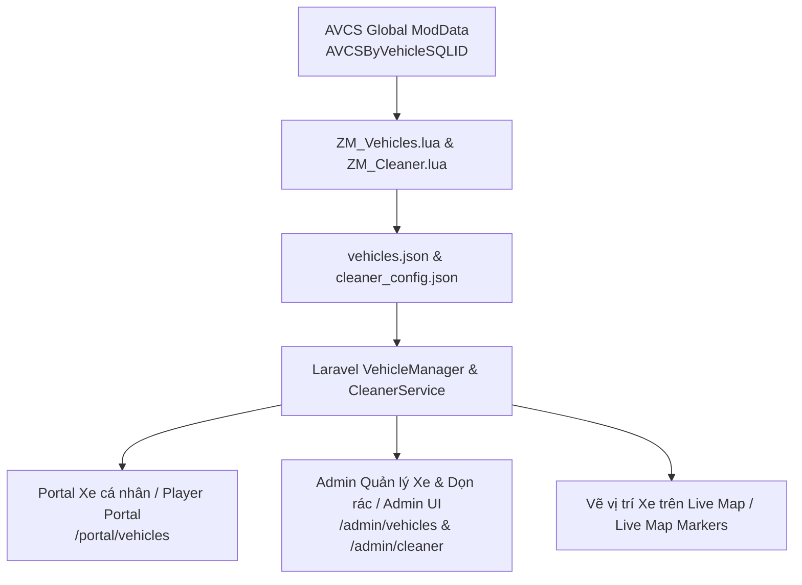

# Kế hoạch Triển khai: Giai đoạn 3 — Quản lý Phương tiện & Tối ưu Server Chống Lag
# Implementation Plan: Phase 3 — Vehicle Manager & Auto Lag Cleaner

---

## 1. Mục tiêu / Objectives

### Tiếng Việt
1. **Quản lý Xe cộ & Tích hợp Another Vehicle Claim System (AVCS - Mod ID: 2957935793)**:
   - Đọc và đồng bộ dữ liệu xe từ Global ModData của AVCS (`AVCSByVehicleSQLID`, `AVCSByPlayerID`) và API xe của máy chủ Project Zomboid Build 42.
   - Theo dõi toàn diện thông tin xe: Chủ sở hữu (`Owner`), Tên dòng xe (`CarModel`), Vị trí tọa độ `(X, Y, Z)`, Tình trạng động cơ (`Engine condition`), Lượng xăng (`Fuel`), Bình ắc quy (`Battery`).
   - Hiển thị vị trí xe trên **Live Map** và danh mục quản lý xe ở cả Web Portal (Người chơi xem xe mình đã claim) và Admin Panel (Admin quản lý toàn bộ xe server).
   - Công cụ quản trị xe: Tìm xe, Dịch chuyển xe (`Teleport`), Sửa chữa xe (`Repair`), Chuyển quyền sở hữu / Gỡ claim (`Unclaim`), Xóa xe rác 0% (`Delete vehicle`).
2. **Bộ Tối ưu & Dọn dẹp Server chống Lag tự động (Auto Lag Cleaner)**:
   - **Dọn dẹp xác Zombie (Dead Body Cleaner)**: Tự động quét và xóa xác zombie tích tụ trên toàn bản đồ theo chu kỳ cấu hình (VD: mỗi 30 phút) để giải phóng RAM/CPU.
   - **Dọn dẹp rác vật phẩm rơi vãi trên mặt đất (Ground Item Cleaner)**: Xóa các vật phẩm rác rơi ngoài đường (quần áo rách, cành cây gãy, mảnh vụn xe hỏng) theo danh sách đen (Blacklist).
   - **Nút "Dọn dẹp ngay" (Instant Clean Now)**: Cho phép Admin kích hoạt dọn rác tức thì từ Web Dashboard.

### English
1. **Vehicle Management & AVCS Integration (Mod ID: 2957935793)**:
   - Read and synchronize vehicle data from AVCS Global ModData (`AVCSByVehicleSQLID`, `AVCSByPlayerID`) and PZ B42 vehicle APIs.
   - Full telemetry tracking: Owner, Car Model, `(X, Y, Z)` coordinates, Engine condition, Fuel level, and Battery charge.
   - Display vehicle positions on **Live Map** and management UI in both Web Portal (player's claimed vehicles) and Admin Dashboard (server-wide fleet management).
   - Administration toolkit: Search, Teleport, Instant Repair, Unclaim/Transfer ownership, and Delete 0% wrecked vehicles.
2. **Auto Lag Cleaner & Performance Optimizer**:
   - **Dead Body Cleaner**: Periodic map-wide sweep to clear accumulated zombie corpses (e.g. every 30m) freeing server RAM/CPU.
   - **Ground Item Cleaner**: Sweep discarded items (rags, broken branches, glass shards) matching a configurable blacklist.
   - **Instant Clean Now Button**: One-click manual cleanup trigger from the admin panel.



---

## 2. Thiết kế Cơ sở Dữ liệu & Models / Database Schema & Models

### 2.1 Bảng `vehicles` / `vehicles` Table (Snapshot xe từ server / Server Vehicle Snapshots)
- `id`: Primary key
- `sql_id`: ID định danh xe trong PZ SQLite / ModData (`getSQLID()`)
- `name`: Tên phương tiện / Vehicle Name (VD: *Chevalier D6*, *Dash Rancher*, *Franklin All-Terrain*)
- `model`: Script name (`Base.PickUpTruck`, `Base.VanSeats`)
- `owner_username`: Tên người chơi sở hữu (từ AVCS) / Claimed owner username
- `owner_user_id`: Foreign key tới `users` (nếu có) / Foreign key to `users`
- `x`, `y`, `z`: Tọa độ vị trí hiện tại / Coordinates
- `engine_condition`: % Tình trạng động cơ (0 - 100%) / Engine condition
- `fuel_level`: % hoặc lít xăng còn lại / Fuel level
- `battery_charge`: % Bình ắc quy / Battery charge %
- `is_claimed`: Boolean (đã được claim qua AVCS / claimed via AVCS)
- `last_seen_at`: Timestamp
- `timestamps`

### 2.2 Bảng `cleaner_configs` / Site Settings
- `clean_bodies_enabled`: Boolean (Bật tự động dọn xác / Auto corpse clean toggle)
- `clean_bodies_interval_minutes`: Chu kỳ dọn xác / Sweep interval in minutes (default: 30m)
- `clean_items_enabled`: Boolean (Bật tự động dọn rác mặt đất / Ground item sweep toggle)
- `clean_items_interval_minutes`: Chu kỳ dọn rác / Ground sweep interval in minutes (default: 60m)
- `clean_items_blacklist`: JSON array các item rác cần xóa (VD: `Base.RippedSheets`, `Base.TreeBranch`, `Base.Twigs`, `Base.ShatteredGlass`, `Base.BrokenBottle`)
- `last_clean_bodies_at`: Timestamp
- `last_clean_items_at`: Timestamp

---

## 3. Game Server Lua Modules

### 3.1 `ZM_Vehicles.lua` (`game-server/mods/ZomboidManager/42/media/lua/server/ZM_Vehicles.lua`)
- Định kỳ quét `ModData.getOrCreate("AVCSByVehicleSQLID")` và các `IsoVehicle` đang nạp trong thế giới game.
- Xuất danh sách xe ra `vehicles.json`:
  ```json
  [
    {
      "sql_id": 1042,
      "name": "Chevalier D6",
      "model": "Base.PickUpTruck",
      "owner": "SurvivorAlex",
      "x": 10742.5,
      "y": 9412.0,
      "z": 0,
      "engine_condition": 88,
      "fuel_level": 75,
      "battery_charge": 90,
      "is_claimed": true
    }
  ]
  ```
- Đọc `vehicle_commands.json` thực hiện các lệnh từ Web:
  - `teleport`: Dịch chuyển xe đến tọa độ người chơi.
  - `repair`: Khôi phục 100% tình trạng xe và đổ đầy xăng.
  - `unclaim`: Xóa dữ liệu sở hữu trong AVCS.
  - `delete`: Xóa phương tiện khỏi thế giới game.

### 3.2 `ZM_Cleaner.lua` (`game-server/mods/ZomboidManager/42/media/lua/server/ZM_Cleaner.lua`)
- Lắng nghe yêu cầu dọn dẹp hoặc tự động dọn dẹp theo lệnh từ server:
  - `clean_dead_bodies`: Duyệt các xác chết `IsoDeadBody` trên các ô đã nạp và loại bỏ.
  - `clean_ground_items`: Quét vật phẩm rơi vãi trên mặt đất trùng với danh sách đen ngoài khu vực Safehouse và xóa bỏ.
- Xuất kết quả dọn dẹp ra log và gửi thông báo Discord.

---

## 4. Giao diện Web Người chơi & Quản trị / Web Portal & Admin Interface

### Tiếng Việt
1. **Player Portal (`/portal/vehicles`)**:
   - Danh sách các xe cá nhân đã Claim qua AVCS.
   - Xem tọa độ, lượng xăng, tình trạng xe và nút "Xem vị trí trên bản đồ".
2. **Admin Panel (`/admin/vehicles`)**:
   - Danh sách toàn bộ xe trong server.
   - Lọc theo: Đã Claim / Chưa Claim / Xe hỏng (Engine < 20%).
   - Thao tác nhanh: **Teleport xe**, **Hồi phục xe 100%**, **Gỡ Claim**, **Xóa xe**.
   - Nút **Dọn toàn bộ xe nát 0%** (One-click cleanup broken cars).
3. **Admin Cleaner (`/admin/cleaner`)**:
   - Cấu hình tự động dọn xác Zombie & Rác mặt đất.
   - Nút **Dọn xác Zombie ngay** và **Dọn rác mặt đất ngay**.
   - Lịch sử nhật ký các lần dọn dẹp (số lượng xác/rác đã dọn).
4. **Tích hợp Live Map (`/admin/players/map`)**:
   - Thêm icon xe trên bản đồ với popup thông tin xe khi click vào.

### English
1. **Player Portal (`/portal/vehicles`)**:
   - List of personal vehicles claimed through AVCS.
   - Telemetry details: coordinates, fuel level, engine condition, and "View on Live Map" button.
2. **Admin Panel (`/admin/vehicles`)**:
   - Fleet-wide vehicle directory.
   - Filters: Claimed / Unclaimed / Wrecked (Engine < 20%).
   - Quick actions: **Teleport Vehicle**, **Repair to 100%**, **Unclaim**, **Delete Vehicle**.
   - **One-click Wreck Cleanup**: Purge 0% condition abandoned vehicles.
3. **Admin Cleaner (`/admin/cleaner`)**:
   - Configuration dashboard for auto corpse and ground clutter sweeps.
   - Instant actions: **Clean Zombie Corpses Now** & **Clean Ground Clutter Now**.
   - Historical cleanup audit logs with item/corpse count statistics.
4. **Live Map Integration (`/admin/players/map`)**:
   - Live vehicle markers with interactive telemetry popups on click.

---

## 5. Các bước Triển khai / Implementation Steps

### Tiếng Việt
1. Tạo migration và models cho `Vehicle` và `CleanerLog`.
2. Viết Lua bridge `ZM_Vehicles.lua` & `ZM_Cleaner.lua`.
3. Viết Services `VehicleManager.php` và `CleanerManager.php`.
4. Viết Artisan command `SyncVehicles` và `RunCleanerCheck`.
5. Tạo Controllers cho Portal và Admin.
6. Xây dựng giao diện React + Inertia: `/portal/vehicles`, `/admin/vehicles`, `/admin/cleaner`.
7. Kiểm thử tính năng (Pest tests & E2E).

### English
1. Create database migrations and Eloquent models for `Vehicle` and `CleanerLog`.
2. Develop Lua bridge scripts `ZM_Vehicles.lua` and `ZM_Cleaner.lua`.
3. Implement backend services `VehicleManager.php` and `CleanerManager.php`.
4. Implement Artisan synchronization commands `SyncVehicles` and `RunCleanerCheck`.
5. Create controllers for Player Portal and Admin Panel.
6. Build frontend UI with React + Inertia for `/portal/vehicles`, `/admin/vehicles`, `/admin/cleaner`.
7. Execute automated tests (Pest feature tests and Playwright E2E).
