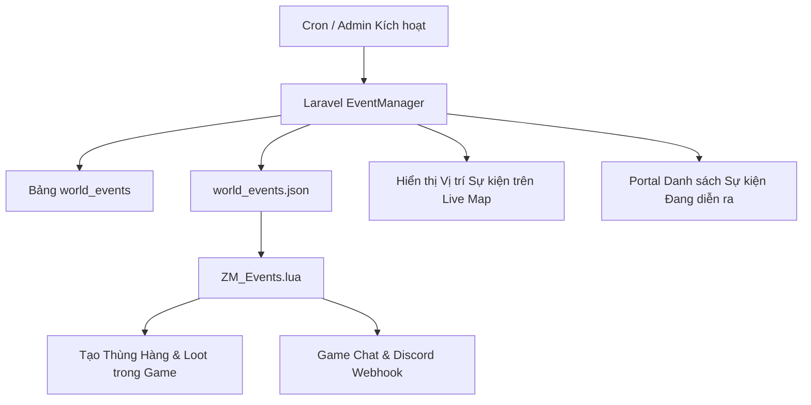

# Kế hoạch Triển khai: Giai đoạn 5 - Hệ thống Sự kiện Thế giới Động (Dynamic World Events: Airdrops, Heli Crashes & Zombie Invasions)

## 1. Mục tiêu
Tạo ra một thế giới Zomboid sống động, kịch tính và khuyến khích người chơi di chuyển, tranh giành tài nguyên trên khắp bản đồ:
1. **Thả Thùng Viện Trợ Quân Sự (Airdrop Supply Drop)**:
   - Thả thùng hàng cứu trợ chứa vũ khí, đạn dược, thuốc men và đồ cứu sinh tại tọa độ ngẫu nhiên trên toàn bản đồ.
   - Phát sóng thông báo toàn server (Broadcast in-game + Web + Discord Webhook).
   - Vẽ Marker định vị trực tiếp trên **Live Map**.
2. **Hiện Trường Trực Thăng Rơi (Helicopter Crash Site)**:
   - Sinh hiện trường tai nạn trực thăng với hòm trang bị quân sự hiếm, vây quanh bởi đàn xác sống đặc biệt.
3. **Đột Kích Đàn Xác Sống (Zombie Horde Invasion)**:
   - Kích hoạt sự kiện quái vật tấn công vào một thị trấn (Rosewood, West Point, Muldraugh, Riverside) trong thời gian giới hạn.
4. **Tự động Hóa & Quản lý Admin (/admin/events)**:
   - Tự động kích hoạt sự kiện ngẫu nhiên theo chu kỳ hoặc kích hoạt thủ công từ Web Admin.
   - Tùy chỉnh danh sách loot vật phẩm và tỉ lệ xuất hiện.

---

## 2. Thiết kế Cơ sở Dữ liệu

### 2.1 Bảng `world_events` (Quản lý các sự kiện thế giới)
- `id`: Primary key
- `event_type`: Enum (`airdrop`, `heli_crash`, `zombie_invasion`)
- `title`: Tên sự kiện (VD: *Thùng Viện Trợ Quân Sự Muldraugh*)
- `description`: Mô tả chi tiết
- `location_name`: Tên khu vực (Rosewood, West Point, Muldraugh...)
- `x`, `y`, `z`: Tọa độ vị trí xảy ra sự kiện
- `radius`: Bán kính ảnh hưởng (mặc định: 30)
- `loot_items`: JSON array danh sách vật phẩm (VD: `[{"item_id": "Base.Axe", "count": 2}, ...]`)
- `reward_coins`: Số Coins thưởng thêm khi mở / hoàn thành
- `status`: Enum (`active`, `looted`, `expired`, `cancelled`)
- `looted_by_username`: Tên người chơi đã loot thùng đồ
- `looted_by_user_id`: Foreign key `users.id`
- `expires_at`: Thời gian hết hạn sự kiện (mặc định: 1 - 2 giờ)
- `looted_at`: Timestamp
- `created_at`, `updated_at`

### 2.2 Bảng `event_loot_presets` (Bộ cấu hình Loot mẫu)
- `id`: Primary key
- `name`: Tên preset (VD: *Military Weapons Drop*, *Medical Supplies*, *Survival Gear*)
- `event_type`: `airdrop` / `heli_crash`
- `items`: JSON array danh sách item và tỉ lệ
- `created_at`, `updated_at`

---

## 3. Các thành phần Phần mềm & Module

1. **Services**:
   - `WorldEventManager.php`: Tạo sự kiện ngẫu nhiên, tạo sự kiện thủ công từ admin, xử lý hoàn thành sự kiện khi người chơi mở thùng đồ, chốt sự kiện hết hạn, đồng bộ `world_events.json`.
2. **Commands & Cron**:
   - `TriggerScheduledEvents.php`: Tự động kích hoạt sự kiện ngẫu nhiên theo chu kỳ.
   - `CheckExpiredEvents.php`: Dọn dẹp các sự kiện đã quá hạn.
3. **Lua Bridge Game Server (`ZM_Events.lua`)**:
   - Đọc `world_events.json`.
   - Sinh thùng đồ (IsoThiggle / Wooden Crate / Metal Box) tại ô `(X, Y, Z)` trên game server.
   - Nạp các item vào hòm đồ `container:AddItem(item_id)`.
   - Kiểm tra khi thùng đồ bị loot hết -> xuất thông báo `looted` về `event_results.json`.
4. **Controllers & Frontend**:
   - `WorldEventPortalController.php` & `app/resources/js/pages/portal/events/index.tsx` (Người chơi xem danh sách sự kiện đang hoạt động, tọa độ, phần thưởng).
   - `WorldEventAdminController.php` & `app/resources/js/pages/admin/events.tsx` (Admin kích hoạt sự kiện tức thì, hủy sự kiện, tùy chỉnh loot).
   - Tích hợp Live Map (`player-map.tsx` & `pz-map.tsx`): Vẽ Icon Sự kiện nhấp nháy động trên bản đồ!

---

## 4. Kế hoạch Kiểm thử & Xác nhận
1. Unit tests:
   - Tạo sự kiện Airdrop ngẫu nhiên tại các địa điểm xác định.
   - Đồng bộ sang `world_events.json`.
   - Xử lý khi sự kiện được loot bởi người chơi và nhận coins.
   - Xử lý hết hạn sự kiện.
2. Feature tests:
   - Các API Portal xem sự kiện, Admin kích hoạt sự kiện và hủy sự kiện.
