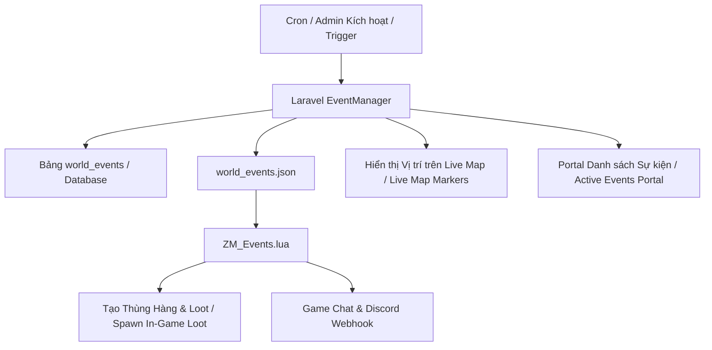

# Kế hoạch Triển khai: Giai đoạn 5 — Hệ thống Sự kiện Thế giới Động
# Implementation Plan: Phase 5 — Dynamic World Events (Airdrops, Heli Crashes & Zombie Invasions)

---

## 1. Mục tiêu / Objectives

### Tiếng Việt
Tạo ra một thế giới Zomboid sống động, kịch tính và khuyến khích người chơi di chuyển, tranh giành tài nguyên trên khắp bản đồ:
1. **Thả Thùng Viện Trợ Quân Sự (Airdrop Supply Drop)**:
   - Thả thùng hàng cứu trợ chứa vũ khí, đạn dược, thuốc men và đồ cứu sinh tại tọa độ ngẫu nhiên trên toàn bản đồ.
   - Phát sóng thông báo toàn server (Broadcast in-game + Web + Discord Webhook).
   - Vẽ Marker định vị trực tiếp trên **Live Map**.
2. **Hiện Trường Trực Thăng Rơi (Helicopter Crash Site)**:
   - Sinh hiện trường tai nạn trực thăng với hòm trang bị quân sự hiếm, vây quanh bởi đàn xác sống đặc biệt.
3. **Đột Kích Đàn Xác Sống (Zombie Horde Invasion)**:
   - Kích hoạt sự kiện quái vật tấn công vào một thị trấn (Rosewood, West Point, Muldraugh, Riverside) trong thời gian giới hạn.
4. **Tự động Hóa & Quản lý Admin (/admin/events)**:
   - Tự động kích hoạt sự kiện ngẫu nhiên theo chu kỳ hoặc kích hoạt thủ công từ Web Admin.
   - Tùy chỉnh danh sách loot vật phẩm và tỉ lệ xuất hiện.

### English
Create an active and thrilling Project Zomboid world that encourages exploration and resource competition across the map:
1. **Military Airdrop Supply Drops**:
   - Drops supply crates containing weapons, ammunition, medicine, and survival gear at randomized map coordinates.
   - Server-wide announcements (In-game broadcast + Web banner + Discord webhook).
   - Dynamic event markers plotted directly on the **Live Map**.
2. **Helicopter Crash Sites**:
   - Spawns helicopter wreckage with rare military weapon caches, guarded by special zombie clusters.
3. **Zombie Horde Invasions**:
   - Timed invasion events attacking key towns (Rosewood, West Point, Muldraugh, Riverside).
4. **Automation & Admin Operations (/admin/events)**:
   - Automated periodic random triggers or instant manual dispatch from the Admin Dashboard.
   - Custom loot pool configuration and drop weight presets.

---

## 2. Thiết kế Cơ sở Dữ liệu / Database Schema

### 2.1 Bảng `world_events` (Quản lý các sự kiện thế giới / Dynamic World Events)
- `id`: Primary key
- `event_type`: Enum (`airdrop`, `heli_crash`, `zombie_invasion`)
- `title`: Tên sự kiện (VD: *Thùng Viện Trợ Quân Sự Muldraugh* / *Muldraugh Military Airdrop*)
- `description`: Mô tả chi tiết / Event description
- `location_name`: Tên khu vực (Rosewood, West Point, Muldraugh...) / Location name
- `x`, `y`, `z`: Tọa độ vị trí xảy ra sự kiện / World coordinates
- `radius`: Bán kính ảnh hưởng / Radius of effect (default: 30)
- `loot_items`: JSON array danh sách vật phẩm (VD: `[{"item_id": "Base.Axe", "count": 2}, ...]`)
- `reward_coins`: Số Coins thưởng thêm khi mở / hoàn thành / Bonus coins reward
- `status`: Enum (`active`, `looted`, `expired`, `cancelled`)
- `looted_by_username`: Tên người chơi đã loot thùng đồ / Looting player username
- `looted_by_user_id`: Foreign key `users.id`
- `expires_at`: Thời gian hết hạn sự kiện / Event expiry timestamp (default: 1 - 2 hours)
- `looted_at`: Timestamp
- `created_at`, `updated_at`

### 2.2 Bảng `event_loot_presets` (Bộ cấu hình Loot mẫu / Loot Presets)
- `id`: Primary key
- `name`: Tên preset / Preset name (VD: *Military Weapons Drop*, *Medical Supplies*, *Survival Gear*)
- `event_type`: `airdrop` / `heli_crash`
- `items`: JSON array danh sách item và tỉ lệ / Items list and drop weights
- `created_at`, `updated_at`

---

## 3. Các thành phần Phần mềm & Module / Software Components & Modules

### Tiếng Việt
1. **Services**:
   - `WorldEventManager.php`: Tạo sự kiện ngẫu nhiên, tạo sự kiện thủ công từ admin, xử lý hoàn thành sự kiện khi người chơi mở thùng đồ, chốt sự kiện hết hạn, đồng bộ `world_events.json`.
2. **Commands & Cron**:
   - `TriggerScheduledEvents.php`: Tự động kích hoạt sự kiện ngẫu nhiên theo chu kỳ.
   - `CheckExpiredEvents.php`: Dọn dẹp các sự kiện đã quá hạn.
3. **Lua Bridge Game Server (`ZM_Events.lua`)**:
   - Đọc `world_events.json`.
   - Sinh thùng đồ (IsoThiggle / Wooden Crate / Metal Box) tại ô `(X, Y, Z)` trên game server.
   - Nạp các item vào hòm đồ `container:AddItem(item_id)`.
   - Kiểm tra khi thùng đồ bị loot hết -> xuất thông báo `looted` về `event_results.json`.
4. **Controllers & Frontend**:
   - `WorldEventPortalController.php` & `app/resources/js/pages/portal/events/index.tsx` (Người chơi xem danh sách sự kiện đang hoạt động, tọa độ, phần thưởng).
   - `WorldEventAdminController.php` & `app/resources/js/pages/admin/events.tsx` (Admin kích hoạt sự kiện tức thì, hủy sự kiện, tùy chỉnh loot).
   - Tích hợp Live Map (`player-map.tsx` & `pz-map.tsx`): Vẽ Icon Sự kiện nhấp nháy động trên bản đồ!

### English
1. **Services**:
   - `WorldEventManager.php`: Generates random events, handles manual triggers from admin, processes completion when crates are looted, cleans expired events, and syncs `world_events.json`.
2. **Commands & Cron**:
   - `TriggerScheduledEvents.php`: Periodic cron command for automated event spawns.
   - `CheckExpiredEvents.php`: Periodic sweeper for expired world events.
3. **Game Server Lua Bridge (`ZM_Events.lua`)**:
   - Reads `world_events.json`.
   - Spawns physical crates (IsoThiggle / Wooden Crate / Metal Box) at `(X, Y, Z)` world coordinates.
   - Inserts generated loot into `container:AddItem(item_id)`.
   - Detects when containers are emptied -> writes `looted` status back to `event_results.json`.
4. **Controllers & Frontend**:
   - `WorldEventPortalController.php` & `app/resources/js/pages/portal/events/index.tsx` (Player portal for active events, coordinates, and rewards).
   - `WorldEventAdminController.php` & `app/resources/js/pages/admin/events.tsx` (Admin dashboard for manual triggers, cancellation, and loot pool editing).
   - Live Map Integration (`player-map.tsx` & `pz-map.tsx`): Animated pulsating event markers on the interactive map.

---

## 4. Kế hoạch Kiểm thử & Xác nhận / Testing & Verification

### Tiếng Việt
1. **Unit tests**:
   - Tạo sự kiện Airdrop ngẫu nhiên tại các địa điểm xác định.
   - Đồng bộ sang `world_events.json`.
   - Xử lý khi sự kiện được loot bởi người chơi và nhận coins.
   - Xử lý hết hạn sự kiện.
2. **Feature & E2E tests**:
   - Các API Portal xem sự kiện, Admin kích hoạt sự kiện và hủy sự kiện.
   - Kiểm tra hiển thị Marker trên giao diện Live Map.

### English
1. **Unit tests**:
   - Generating random Airdrop events at designated map clusters.
   - Synchronizing event manifests to `world_events.json`.
   - Processing loot discovery events and crediting reward coins.
   - Handling event expiration lifecycles.
2. **Feature & E2E tests**:
   - Portal event queries, Admin manual trigger and cancellation API endpoints.
   - Interactive Live Map event icon rendering and popup verification.

