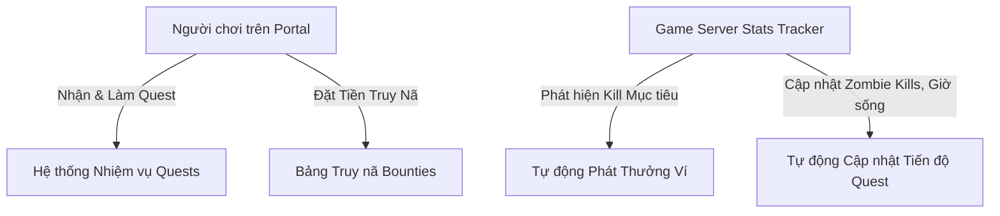

# Kế hoạch Triển khai: Giai đoạn 2 - Hệ thống Nhiệm vụ & Săn tiền thưởng (Daily/Weekly Quests & Player Bounty)

## 1. Mục tiêu
Xây dựng hệ thống Nhiệm vụ (Quests) và Săn tiền thưởng (Player Bounty) tương tác 2 chiều giữa Web Portal và Máy chủ Project Zomboid Build 42.

---

## 2. Thiết kế Cơ sở Dữ liệu & Models

### 2.1 Bảng `quests`
- `id`: Primary key
- `title`: Tên nhiệm vụ (VD: *Thợ săn Zombie Rosewood*, *Sinh tồn qua đêm đông*)
- `description`: Chi tiết nhiệm vụ
- `type`: `daily` (hàng ngày), `weekly` (hàng tuần), `achievement` (thành tựu)
- `category`: `zombie_kills` (diệt zombie), `survival_hours` (giờ sinh tồn), `pvp_kills` (diệt người chơi), `custom`
- `target_count`: Số lượng mục tiêu cần đạt (VD: 50, 100, 24)
- `reward_coins`: Số tiền thưởng chuyển vào Ví Portal
- `reward_items`: Danh sách vật phẩm quà tặng dạng JSON `[{"item_id": "Base.Axe", "count": 1}]` (tùy chọn)
- `is_active`: Boolean
- `starts_at`, `expires_at`: Thời gian bắt đầu / kết thúc

### 2.2 Bảng `player_quests`
- `id`: Primary key
- `quest_id`: Foreign key tới `quests`
- `user_id`: Foreign key tới `users`
- `username`: Tên nhân vật in-game
- `current_progress`: Số lượng đã hoàn thành (VD: 35/50)
- `is_completed`: Boolean
- `completed_at`: Timestamp
- `reward_claimed`: Boolean
- `claimed_at`: Timestamp

### 2.3 Bảng `bounties`
- `id`: Primary key
- `target_username`: Tên người chơi bị truy nã
- `target_user_id`: Nullable foreign key tới `users`
- `creator_id`: Foreign key tới `users` (người đặt lệnh truy nã, hoặc `null` nếu là lệnh truy nã từ Server/Admin)
- `reward_amount`: Số tiền thưởng (được trừ từ ví người đặt và giữ trong quỹ truy nã)
- `reason`: Lý do truy nã (VD: *PK cướp xe tại West Point*, *Phá hoại căn cứ*)
- `status`: `active` (đang có hiệu lực), `claimed` (đã có người tiêu diệt và nhận thưởng), `cancelled` (hủy lệnh & hoàn tiền ví), `expired`
- `hunter_username`: Tên người chơi đã tiêu diệt mục tiêu và nhận thưởng
- `hunter_user_id`: Nullable foreign key tới `users`
- `claimed_at`: Timestamp
- `expires_at`: Timestamp

---

## 3. Kiến trúc Services & Xử lý Backend

### 3.1 `QuestManager.php` (`app/app/Services/QuestManager.php`)
- `syncPlayerQuests(User $user)`: Tự động gán các daily/weekly quest đang active cho người chơi.
- `updateProgress(User $user)`: Đối chiếu số zombie kills, survival hours từ `player_stats` để cập nhật `current_progress` và đánh dấu `is_completed`.
- `claimReward(User $user, int $questId)`: Cộng `reward_coins` vào Ví cá nhân và tạo đơn giao vật phẩm `reward_items` (nếu có).

### 3.2 `BountyManager.php` (`app/app/Services/BountyManager.php`)
- `createBounty(User $creator, string $targetUsername, float $rewardAmount, string $reason)`: Trừ tiền ví của người tạo, kích hoạt lệnh truy nã và bắn webhook Discord thông báo toàn server.
- `processPvpKill(string $killerUsername, string $victimUsername)`: Kiểm tra xem `victimUsername` có lệnh truy nã `active` không. Nếu có, tự động hoàn tất bounty, cộng tiền thưởng vào ví của `killerUsername`, gửi tin nhắn thông báo trên Discord và in-game.
- `cancelBounty(int $bountyId, User $actor)`: Hủy lệnh và hoàn trả 100% tiền vào ví người đặt.

### 3.3 Command Định kỳ `zomboid:process-quests-bounties`
- Chạy mỗi phút (qua cron/schedule) để đồng bộ tiến độ quest cho người chơi online và kiểm tra các sự kiện PvP mới nhất để khớp lệnh truy nã.

---

## 4. Giao diện Người chơi & Quản trị

1. **Player Portal (`/portal/quests`)**:
   - **Tab Nhiệm vụ**: Danh sách Daily / Weekly quests với thanh tiến trình trực quan, hiển thị tiền thưởng và nút "Nhận thưởng".
   - **Tab Bảng Truy nã (Bounties Board)**: Danh sách tội phạm đang bị truy nã, số tiền thưởng, lý do, nút "Đặt lệnh truy nã người chơi".
   - **Tab Lịch sử Thợ săn (Bounty Claims)**: Nhật ký các vụ săn tiền thưởng thành công.
2. **Admin Management (`/admin/quests`)**:
   - Quản lý tạo/sửa/xóa Nhiệm vụ Daily/Weekly/Thành tựu.
   - Quản lý lệnh truy nã: Tạo lệnh truy nã từ Server, hủy bỏ / hoàn tiền bounty.
3. **Sidebar Navigation**:
   - Thêm mục **Nhiệm vụ & Truy nã (Quests & Bounty)** vào thanh điều hướng.

---

## 5. Kế hoạch Thực hiện

1. Tạo Database Migrations cho `quests`, `player_quests`, `bounties`.
2. Tạo Models và Factories.
3. Xây dựng Services `QuestManager` và `BountyManager`.
4. Tạo Artisan Command `ProcessQuestsAndBounties`.
5. Tạo Controllers `QuestPortalController` và `QuestAdminController`.
6. Đăng ký Routes, Permissions và Translations.
7. Xây dựng Giao diện React Frontend cho Portal và Admin.
8. Viết Unit & Feature Tests, biên dịch frontend và kiểm thử hệ thống.
