<div align="center">


# Zomboid Manager
### Web Panel Toàn Diện Quản Trị Máy Chủ Project Zomboid Dedicated Server
**Full-stack web panel for managing a Project Zomboid dedicated server.**

[](https://laravel.com)
[](https://react.dev)
[](https://typescriptlang.org)
[](https://tailwindcss.com)
[](https://postgresql.org)
[](https://docs.docker.com/compose/)
[](LICENSE)

[Tính Năng (#features)](#tính-năng--features) · [Cài Đặt Nhanh (#quick-start)](#khởi-động-nhanh--quick-start) · [Tài Liệu Hướng Dẫn (#documentation)](#documentation--tài-liệu-hướng-dẫn) · [Hình Ảnh Giao Diện (#screenshots)](#hình-ảnh-giao-diện--screenshots) · [Kiến Trúc Hệ Thống (#architecture)](#kiến-trúc-hệ-thống--architecture)

</div>

---

## Tổng Quan / Overview

### Tiếng Việt (Primary)
**Zomboid Manager** là nền tảng quản trị web toàn diện bọc quanh máy chủ game Project Zomboid Dedicated Server chạy trên môi trường Docker, kết hợp giữa backend **Laravel 12 REST API** và frontend **React 19 + Inertia.js v2 + TypeScript**. Hệ thống cung cấp khả năng điều khiển máy chủ từ xa thông qua 3 điểm tích hợp cốt lõi:

- **RCON Protocol** — Giao thức Source RCON TCP thời gian thực: thực thi lệnh quản trị, gửi thông báo in-game, lưu thế giới tức thì.
- **Docker Engine API** — Quản lý vòng đời container (bật, tắt, khởi động lại, cập nhật game) qua Docker socket proxy an toàn.
- **File I/O Trực Tiếp** — Đọc/ghi cấu hình server (`server.ini`, sandbox Lua) mount trực tiếp từ volume máy chủ game.

Bao gồm hơn 21 trang quản trị admin, trang trạng thái công khai, cổng thông tin người chơi (Player Portal), cửa hàng vật phẩm & ví tiền (Item Shop), hơn 40+ REST API endpoints, thông báo Discord Webhooks, bản đồ tương tác người chơi thời gian thực (Live Map), quản lý túi đồ, vùng an toàn Safe Zones, tùy biến giao diện website và đa ngôn ngữ (i18n).

### English (Secondary)
Zomboid Manager wraps a Dockerized Project Zomboid dedicated server with a Laravel REST API and a React + Inertia.js web dashboard. It provides remote management through three integration points: RCON, Docker Engine API, and File I/O. Over 21 admin pages, public status page, player portal, item shop, 40+ API endpoints, Discord notifications, interactive map, safe zones, site customization, and full i18n support.

---

## Trạng Thái Tính Năng / Feature Status

| Hạng mục / Area | Trạng thái / Status | Ghi chú / Notes |
|---|---|---|
| Hạ tầng Docker / Docker Infrastructure | Hoàn thành / Done | Đa kiến trúc (ARM64 + AMD64), tự nhận diện |
| Cầu nối RCON / RCON Client | Hoàn thành / Done | PHP Source RCON client thuần |
| Điều khiển Server / Server Control | Hoàn thành / Done | Bật, tắt, khởi động lại, lưu world, wipe, update |
| Chỉnh sửa Cấu hình / Config Editor | Hoàn thành / Done | Giao diện trực quan cho server.ini + Sandbox Lua |
| Quản lý Người chơi / Player Admin | Hoàn thành / Done | Kick, ban, teleport, set quyền, cấp XP, God mode |
| Quản lý Mod / Mod Management | Hoàn thành / Done | Tích hợp Steam Workshop, kéo thả sắp xếp thứ tự nạp |
| Sao lưu & Rollback / Backups | Hoàn thành / Done | Thủ công & tự động định kỳ, chính sách lưu giữ |
| Quản lý Whitelist | Hoàn thành / Done | CRUD & đồng bộ SQLite `serverPZ.db` |
| Nhật ký Hoạt động / Audit Logging | Hoàn thành / Done | Ghi vết mọi thao tác Admin với IP, User, Payload |
| Bảng điều khiển Web / Web Dashboard | Hoàn thành / Done | React 19 + Inertia.js v2 + shadcn/ui |
| Bản đồ Trực tiếp / Interactive Live Map | Hoàn thành / Done | Leaflet với Marker vị trí người chơi & sự kiện |
| Quản lý Kho đồ / Inventory Management | Hoàn thành / Done | Xem, cấp/xóa item với hơn 1,100+ icon hình ảnh |
| Thông báo Discord / Discord Webhooks | Hoàn thành / Done | Hơn 25+ sự kiện thông báo qua Webhook |
| Vùng An Toàn / Safe Zones | Hoàn thành / Done | Khu vực cấm PvP với theo dõi vi phạm |
| Trì hoãn Hồi sinh / Respawn Delay | Hoàn thành / Done | Thời gian chờ hồi sinh tùy biến sau khi chết |
| Bảng điều khiển RCON Console | Hoàn thành / Done | Console trên trình duyệt với lịch sử lệnh |
| Nhật ký Máy chủ / Server Logs | Hoàn thành / Done | Trình xem log trực tiếp với bộ lọc tìm kiếm |
| Xác thực & Bảo mật / Authentication | Hoàn thành / Done | Fortify session, Sanctum token, API Key, 2FA |
| Cài đặt Người dùng / User Settings | Hoàn thành / Done | Hồ sơ, đổi mật khẩu, giao diện sáng/tối, 2FA |
| Trang Trạng Thái / Public Status Page | Hoàn thành / Done | Trạng thái server online/offline, số người chơi |
| Trang Giới Thiệu / Welcome Page | Hoàn thành / Done | Landing page với thống kê cộng đồng & bảng vinh danh |
| Bảng Xếp Hạng / Rankings Leaderboard | Hoàn thành / Done | 6 bảng xếp hạng chỉ số sinh tồn |
| Cổng Người Chơi / Player Portal | Hoàn thành / Done | Xem tài khoản, vị trí map, phương tiện, nhiệm vụ |
| Tự Động Khởi Động Lại / Auto Restart | Hoàn thành / Done | Lên lịch restart hàng ngày với cảnh báo đếm ngược |
| Cửa Hàng & Ví Tiền / Shop & Wallet | Hoàn thành / Done | Mua vật phẩm/gói combo, mã giảm giá, nạp tiền ví |
| Nạp Tiền In-Game / Money Deposit | Hoàn thành / Done | Chuyển đổi tiền nhặt trong game thành số dư ví |
| Hệ Thống Nhiệm Vụ & Bounties | Hoàn thành / Done | Daily/Weekly quests & Săn tiền thưởng truy nã |
| Quản Lý Xe Cộ & Dọn Lag Server | Hoàn thành / Done | Quản lý xe, tích hợp AVCS, dọn xác zombie & rác |
| Sự Kiện Thế Giới Động / World Events | Hoàn thành / Done | Thả Airdrop quân sự, trực thăng rơi, quái xâm lăng |
| Tùy Biến Giao Diện / Site Customization | Hoàn thành / Done | Tùy biến logo/favicon, banner, bố cục, màu sắc theme |
| Ứng Dụng PWA / Progressive Web App | Hoàn thành / Done | Dynamic Manifest, icon tự tạo, Service Worker offline |
| Đa Ngôn Ngữ / i18n Translations | Hoàn thành / Done | Hỗ trợ chuyển đổi đa ngôn ngữ linh hoạt |

---

## Tính Năng / Features

### 1. Tùy Biến Giao Diện & Đa Ngôn Ngữ / Site Customization & i18n
Trang cấu hình tại `/admin/site-settings`: chỉnh sửa tên trang web, tải lên logo/favicon, nội dung chân trang (footer), phần banner giới thiệu (hero section), các thẻ tính năng (lên đến 8 thẻ kèm bộ chọn icon), bật/tắt và sắp xếp thứ tự các section trên trang chủ, tùy biến bảng màu theme (chọn mã hex và tự động chuyển đổi sang oklch). Hệ thống đa ngôn ngữ tại `/admin/translations` cho phép quản lý ngôn ngữ động, nạp/xuất file JSON để dịch offline.

### 2. Trang Chào Mừng & Bảng Vinh Danh / Welcome Page & Leaderboard
Trang đích công khai (`/welcome`) hiển thị trạng thái máy chủ theo thời gian thực, tổng số người chơi, số zombie đã tiêu diệt, tổng giờ sinh tồn, bục vinh danh top người chơi và tổng quan tính năng. Không yêu cầu đăng nhập.

### 3. Điều Khiển & Giám Sát Server / Server Control & Monitoring
Bật, tắt, khởi động lại, lưu thế giới tức thì, wipe dữ liệu và cập nhật game server trực tiếp từ web panel. Các tác vụ khởi động lại sẽ tự động phát sóng thông điệp đếm ngược vào trong game.

### 4. Quản Lý Người Chơi / Player Management
Bảng danh sách người chơi trực quan với tìm kiếm và lọc. Thao tác nhanh: kick, ban/unban, phân quyền (admin, moderator, GM...), dịch chuyển (teleport), cấp vật phẩm, cộng điểm kinh nghiệm XP, bật chế độ bất tử (god mode).

### 5. Bản Đồ Tương Tác Trực Tiếp / Interactive Live Map
Bản đồ Leaflet hiển thị toàn bộ Kentucky và các bản đồ Mod. Theo dõi vị trí người chơi theo thời gian thực, hiển thị xe cộ và các điểm sự kiện Airdrop đang diễn ra.

### 6. Quản Lý Túi Đồ / Inventory Management
Xem trực tiếp túi đồ của người chơi với hơn 1,100+ hình ảnh icon vật phẩm. Cấp phát đồ từ xa qua RCON và theo dõi trạng thái nhận đồ.

### 7. Trình Chỉnh Sửa Cấu Hình / Configuration Editor
Chỉnh sửa `server.ini` và `SandboxVars.lua` trực tiếp trên trình duyệt với giao diện phân loại rõ ràng và gợi ý thông số an toàn.

### 8. Quản Lý Mod Steam Workshop / Mod Management
Thêm mod bằng ID Steam Workshop. Hệ thống tự động đồng bộ dòng `WorkshopItems=` và `Mods=`. Hỗ trợ kéo thả để sắp xếp thứ tự nạp mod.

### 9. Sao Lưu & Khôi Phục / Backup & Rollback
Tạo bản sao lưu thủ công hoặc cấu hình lịch sao lưu tự động. Khôi phục về bất kỳ bản snapshot nào với cơ chế sao lưu phòng ngừa trước khi rollback.


CRUD operations on the PZ whitelist stored in `serverPZ.db` (SQLite). Add, remove, and toggle player entries. Sync the whitelist from the game server's live database. Configure auto-whitelist behavior.

<details>
<summary>Screenshot</summary>

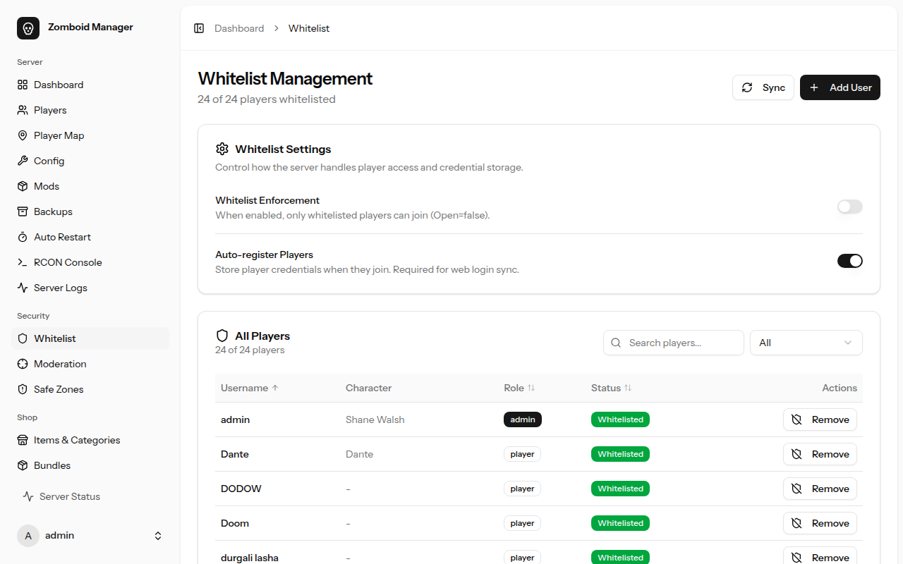
</details>

### Safe Zones

Define PvP-free rectangular zones on the map with coordinates. The Lua bridge mod enforces zones server-side. Violations are tracked with attacker/victim details, zone info, strike count, and coordinates. Resolve violations by dismissing or taking action. Toggle the entire system on/off.

<details>
<summary>Screenshot</summary>

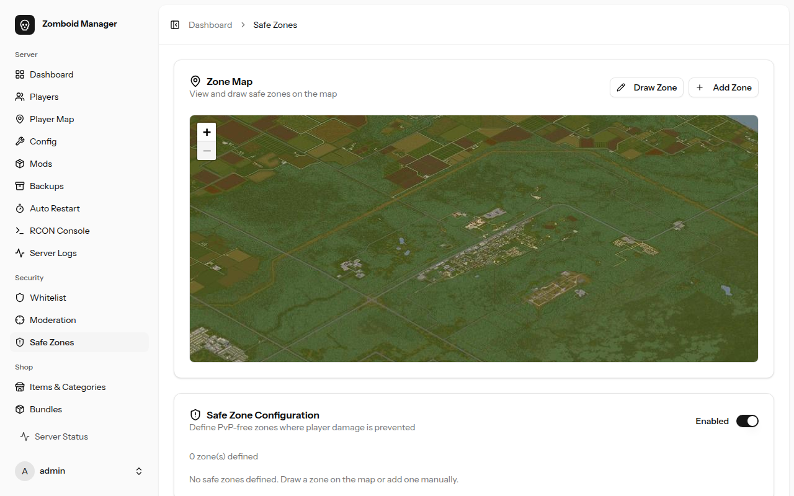
</details>

### Moderation & Events

Centralized moderation view showing PvP violations, safe zone events, and player action history. Filter by player, zone, or event type. Escalating strike system for repeat offenders.

<details>
<summary>Screenshot</summary>

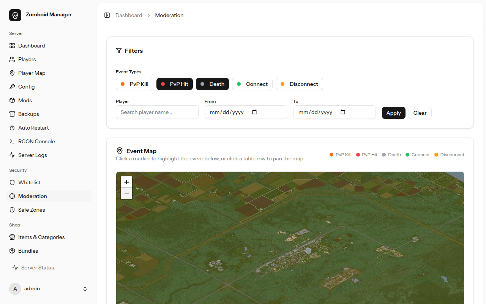
</details>

### RCON Console

Browser-based RCON console with command history. Send any RCON command and see the response in real time. Autocomplete for common commands.

<details>
<summary>Screenshot</summary>

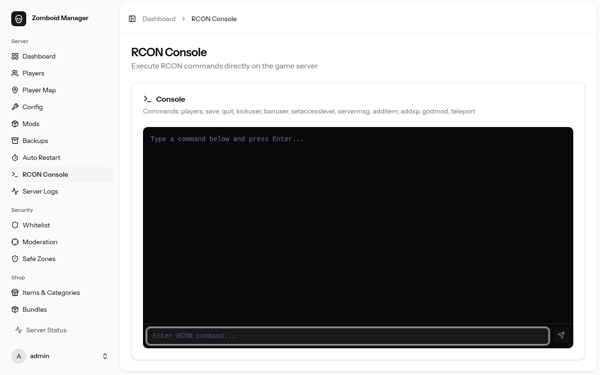
</details>

### Server Logs

Live server log viewer with auto-refresh. Filter logs by type and search within log content. View logs from the game server's output directly in the browser.

<details>
<summary>Screenshot</summary>

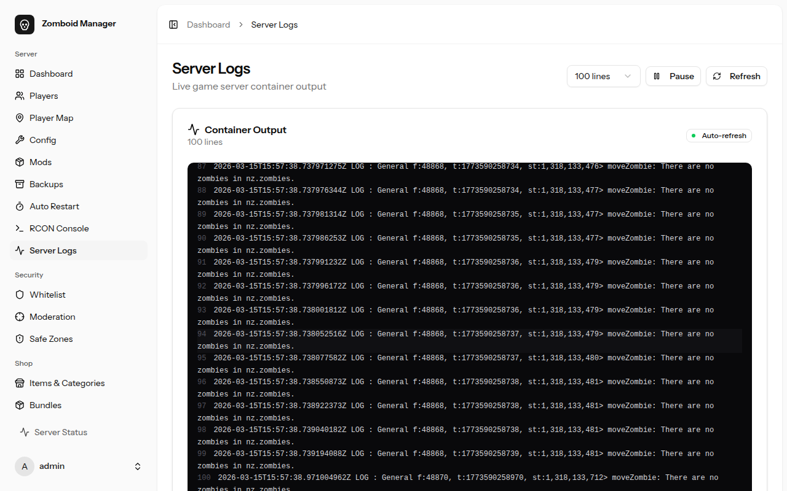
</details>

### Audit Logging

Every admin action is recorded with: timestamp, user, action type, IP address, and full request payload. Browse, search, and filter the audit trail from the admin panel.

<details>
<summary>Screenshot</summary>

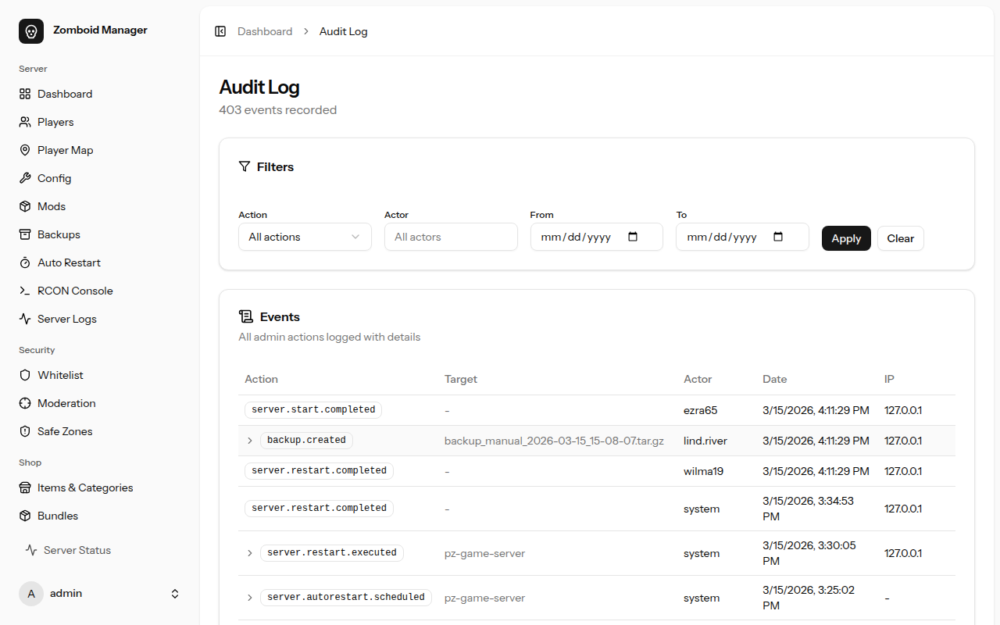
</details>

### Discord Webhooks

25+ configurable Discord webhook notifications across server control, backup management, player actions, safe zone events, and respawn delay changes. Per-event toggle. Test webhook delivery from the settings page. Rich embeds with color-coded categories and emoji.

<details>
<summary>Screenshot</summary>

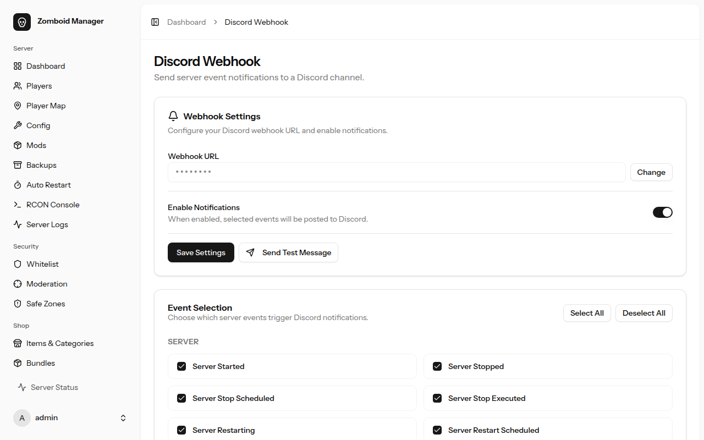
</details>

### 10. Quản Lý Danh Sách Cho Phép / Whitelist Management
Thao tác CRUD trực tiếp trên database Whitelist `serverPZ.db` (SQLite). Thêm, xóa và bật/tắt quyền truy cập người chơi. Đồng bộ danh sách với database sống của máy chủ game.

<details>
<summary>Ảnh chụp màn hình / Screenshot</summary>


</details>

### 11. Vùng An Toàn / Safe Zones
Thiết lập các vùng hình chữ nhật không PvP trên bản đồ theo tọa độ. Lua bridge mod tự động thực thi vùng an toàn phía server. Theo dõi lịch sử vi phạm chi tiết.

<details>
<summary>Ảnh chụp màn hình / Screenshot</summary>


</details>

### 12. Điều Hành & Sự Kiện Vi Phạm / Moderation & Events
Bảng điều hành tập trung hiển thị các vi phạm PvP, sự kiện Safe Zone và lịch sử hành vi người chơi kèm hệ thống cảnh cáo tăng dần (strike system).

<details>
<summary>Ảnh chụp màn hình / Screenshot</summary>


</details>

### 13. Bảng Điều Khiển RCON Console / RCON Console
Console RCON trên nền web với lịch sử lệnh, tự động gợi ý lệnh và nhận phản hồi tức thì từ máy chủ game.

<details>
<summary>Ảnh chụp màn hình / Screenshot</summary>


</details>

### 14. Xem Nhật Ký Máy Chủ / Server Logs
Trình xem log thời gian thực với tính năng tự động làm mới, lọc theo danh mục và tìm kiếm nội dung trực tiếp.

<details>
<summary>Ảnh chụp màn hình / Screenshot</summary>


</details>

### 15. Nhật Ký Hoạt Động Quản Trị / Audit Logging
Mọi thao tác của Admin được lưu vết đầy đủ: thời gian, người thực hiện, loại hành động, địa chỉ IP và toàn bộ payload dữ liệu.

<details>
<summary>Ảnh chụp màn hình / Screenshot</summary>


</details>

### 16. Thông Báo Discord / Discord Webhooks
Hơn 25+ sự kiện thông báo qua Webhook Discord (bật/tắt server, backup, hành vi người chơi, sự kiện safe zone...). Hỗ trợ test trực tiếp trên giao diện cài đặt.

<details>
<summary>Ảnh chụp màn hình / Screenshot</summary>


</details>

### 17. Cửa Hàng Vật Phẩm & Ví Tiền / Item Shop & Wallet
Xem và mua vật phẩm/combo đồ in-game bằng số dư ví. Phân loại danh mục, tìm kiếm, vật phẩm nổi bật, mã khuyến mãi giảm giá %, lịch sử giao dịch và ví tiền.

<details>
<summary>Ảnh chụp màn hình / Screenshot</summary>

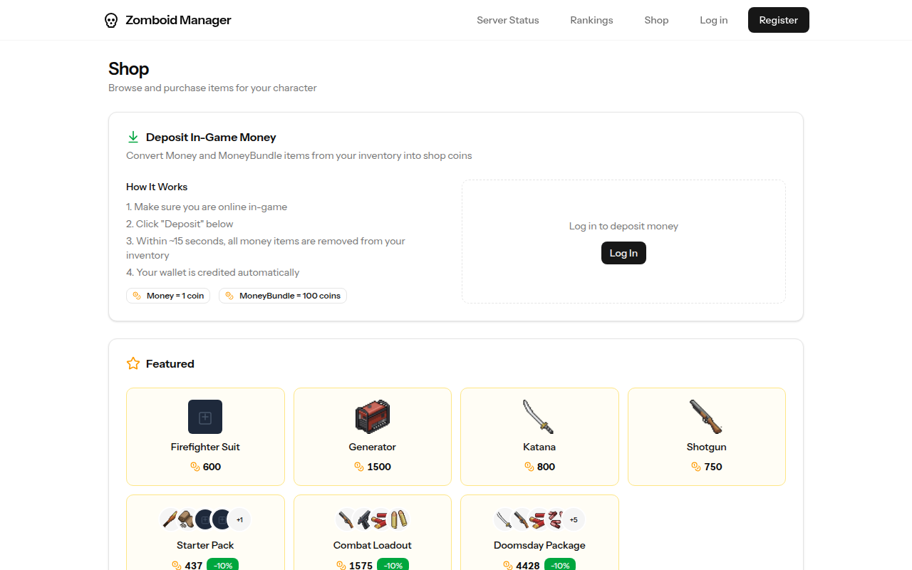
</details>

### 18. Nạp Tiền In-Game Vào Ví Web / In-Game Money Deposit
Người chơi nhặt tiền `Base.Money` (1 coin) và `Base.MoneyStack` (10 coins) từ Zombie có thể nạp trực tiếp vào ví Web. Khi bấm "Deposit", Lua bridge sẽ tự động thu hồi tiền trong túi và cộng số dư ví tương ứng.

<details>
<summary>Ảnh chụp màn hình / Screenshot</summary>

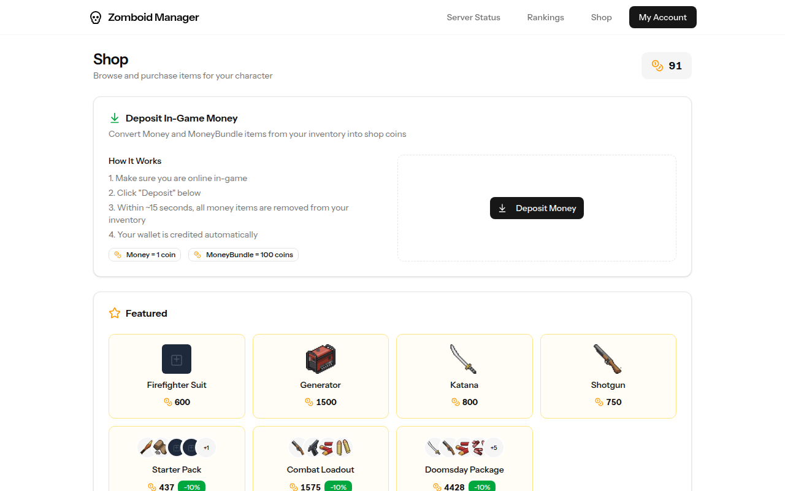
</details>

### 19. Xác Thực & Bảo Mật / Authentication & Security
- **Web Auth** — Laravel Fortify với đăng nhập theo Session an toàn.
- **Xác thực 2 yếu tố (2FA)** — TOTP QR code, mã dự phòng.
- **API Key & Token** — Xác thực header `X-API-Key` và Laravel Sanctum Tokens cho API bên ngoài.
- **Role Middleware** — Phân quyền Admin chặt chẽ.

### 20. Trang Trạng Thái Công Khai / Public Status Page
Trang theo dõi trạng thái máy chủ không cần đăng nhập: online/offline, số lượng người chơi, danh sách người chơi online, tên server và thời gian hoạt động.

<details>
<summary>Ảnh chụp màn hình / Screenshot</summary>

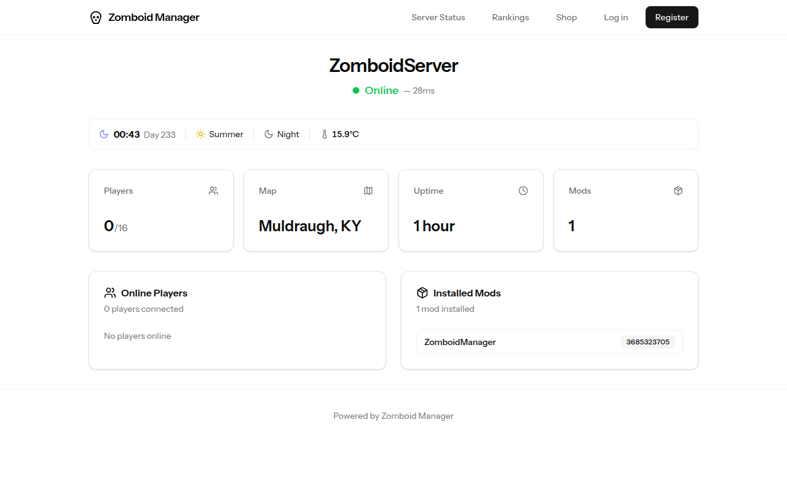
</details>

### 21. Bảng Xếp Hạng Người Chơi / Rankings
Bảng xếp hạng công khai với 6 tiêu chí: số zombie đã diệt, thời gian sinh tồn, số lần chết, K/D ratio, tỉ lệ sống sót và PvP kills.

<details>
<summary>Ảnh chụp màn hình / Screenshot</summary>

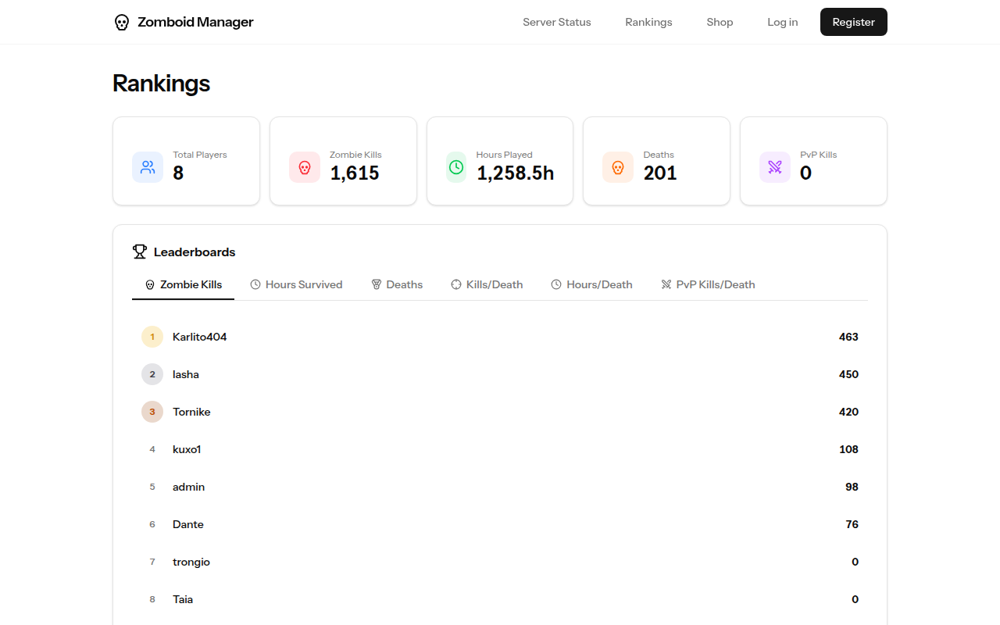
</details>

### 22. Cổng Thông Tin Người Chơi / Player Portal
Trang cá nhân của người chơi hiển thị tài khoản game, trạng thái Whitelist, liên kết cài đặt hồ sơ và bản đồ hiển thị vị trí nhân vật.

<details>
<summary>Ảnh chụp màn hình / Screenshot</summary>

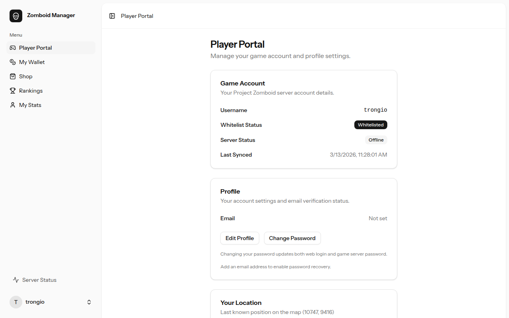
</details>

### 23. Tự Động Khởi Động Lại / Auto Restart
Lên lịch tối đa 5 khung giờ tự động restart máy chủ mỗi ngày, tích hợp thông báo đếm ngược trong game và cảnh báo qua Discord.

<details>
<summary>Ảnh chụp màn hình / Screenshot</summary>

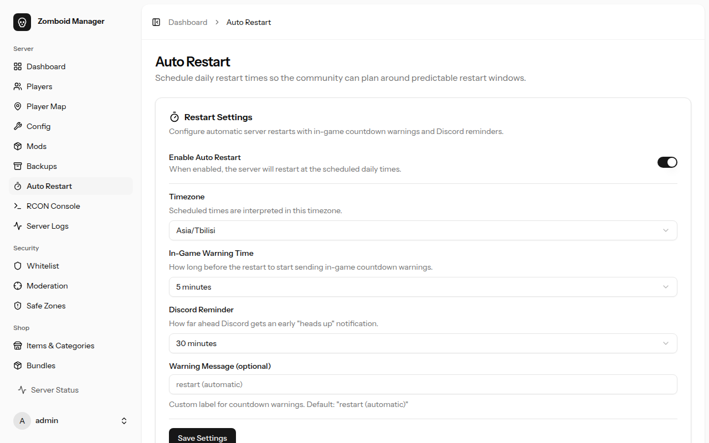
</details>

---

## Kiến Trúc Hệ Thống / Architecture

Hệ thống bao gồm 7 dịch vụ Docker phân bổ trên 2 mạng (networks):

```
                          Internet
                             │
                ┌────────────┼──────────────────────────────────────┐
                │            │                                      │
                │  UDP 16261-16262        TCP 80/443                │
                │            │               │                      │
                │  ┌─────────▼────────┐  ┌───▼──────────────────┐   │
                │  │  game-server     │  │  caddy               │   │
  zomboid-net   │  │  PZ Dedicated    │  │  Reverse proxy       │   │
   (bridge)     │  │  SteamCMD        │  │  Auto-TLS            │   │
                │  │                  │  └───┬──────────────────┘   │
                │  │  RCON 27015 ◄────│──┐   │                      │
                │  └──────────────────┘  │ ┌─▼──────────────────┐   │
                │                        │ │  app               │   │
                │                        └─│  Laravel + Nginx   │   │
                │                          │  React dashboard   │   │
                │                          └──┬─────────────────┘   │
                │                             │                     │
                │                       ┌─────▼─────────────────┐   │
                │                       │  queue                │   │
                │                       │  Backup jobs          │   │
                │                       │  Restart jobs         │   │
                │                       │  Scheduled tasks      │   │
                │                       └─────┬─────────────────┘   │
                └─────────────────────────────┼─────────────────────┘
                                              │
                ┌─────────────────────────────┼─────────────────────┐
                │                             │                     │
  backend-net   │  ┌──────────────┐    ┌──────▼──────┐              │
  (internal)    │  │  db          │    │  redis      │              │
                │  │  PgSQL 16    │    │  Queue      │              │
                │  │  App data    │    │  Cache      │              │
                │  └──────────────┘    │  Sessions   │              │
                │                      └─────────────┘              │
                │                                                   │
                │        ┌──────────────────────────────────────┐   │
                │        │  docker-socket-proxy                 │   │
                │        │  Tecnativa — restricted Docker API   │   │
                │        │  (containers, logs, start/stop only) │   │
                │        └──────────────────────────────────────┘   │
                └───────────────────────────────────────────────────┘
```

- **game-server** — Máy chủ PZ Dedicated Server chạy qua SteamCMD (tự động nhận diện ARM64 / AMD64).
- **app** — Web panel Laravel 12 + React 19, điều khiển server qua socket proxy an toàn.
- **queue** — Worker xử lý tác vụ nền: sao lưu, restart theo lịch, update game.
- **db** — PostgreSQL 16 lưu trữ dữ liệu người dùng, audit logs, cửa hàng, nhiệm vụ.
- **redis** — Hàng đợi job, cache, session và rate limiting.
- **docker-socket-proxy** — Giới hạn quyền truy cập Docker API (chỉ inspect, start/stop, logs).
- **caddy** — Reverse proxy tự động cấp phát HTTPS SSL (Let's Encrypt).

---

## Khởi Động Nhanh / Quick Start

### Yêu Cầu / Requirements
- **Linux:** Docker Engine, Docker Compose v2, Git, Make (xem [Hướng dẫn Linux](docs/installation-linux.md)).
- **Windows:** Docker Desktop (WSL 2 backend), Git for Windows (xem [Hướng dẫn Windows](docs/installation-windows.md)).

### Lệnh Cài Đặt / Installation Commands

```bash
# Trên Linux
git clone https://github.com/nmhung1993/ProjectZomboid_ServerManager_Webapp.git
cd ProjectZomboid_ServerManager_Webapp
make init
```

```powershell
# Trên Windows (PowerShell)
git clone https://github.com/nmhung1993/ProjectZomboid_ServerManager_Webapp.git
cd ProjectZomboid_ServerManager_Webapp
.\make.ps1 init
# hoặc chạy nhanh:
.\easy-init.ps1
```

Trình wizard cài đặt tương tác sẽ tự động:
1. Hỏi môi trường (production/dev), tài khoản Admin và cấu hình server
2. Tự động sinh file `.env` với các secret key an toàn ngẫu nhiên
3. Build và khởi động toàn bộ 7 container
4. Chạy database migrations và tạo tài khoản Admin

Truy cập Web Panel ngay tại: `http://localhost:8000` hoặc địa chỉ HTTPS cấu hình.


### Chế Độ Truy Cập / Access Modes

Khi chạy `make init`, bạn có thể lựa chọn 3 chế độ truy cập:

| Chế độ / Mode | Mục đích sử dụng / Use Case | Chứng chỉ TLS / TLS Cert |
|---|---|---|
| **Public — Domain** | Máy chủ production có gắn tên miền riêng | Tự động qua Let's Encrypt (Auto HTTPS) |
| **Public — IP address** | Máy chủ dùng IP công khai hoặc IP mạng LAN | Chứng chỉ tự ký (Self-signed Caddy CA) |
| **Local only** | Chạy thử nghiệm cục bộ trên máy (`localhost:8000`) | Chứng chỉ nội bộ |

*Lưu ý: Bảng điều khiển Web luôn sẵn sàng truy cập nội bộ tại `http://localhost:8000` trên máy chủ.*


## Documentation / Tài Liệu Hướng Dẫn

| Hướng dẫn / Guide | Mô tả / Description |
|---|---|
| [Linux Installation](docs/installation-linux.md) | Yêu cầu, thiết lập và từng bước cài đặt trên Linux *(Linux setup instructions)* |
| [Windows Installation](docs/installation-windows.md) | Hướng dẫn cài đặt trên Windows Desktop và Windows Server *(Windows setup guide)* |
| [Command Reference](docs/commands.md) | Bảng tra cứu tất cả các lệnh `make` & `make.ps1` *(All management commands)* |
| [Troubleshooting & FAQ](docs/troubleshooting.md) | Khắc phục sự cố, lưu ý nhà mạng Cloud, cấu hình phần cứng *(Troubleshooting guide)* |
| [Firewall — UFW](docs/firewall-ufw.md) | Cấu hình tường lửa Ubuntu/Debian *(UFW firewall guide)* |
| [Firewall — firewalld](docs/firewall-firewalld.md) | Cấu hình tường lửa Fedora/RHEL/CentOS *(firewalld guide)* |
| [Firewall — Manual](docs/firewall-manual.md) | Hướng dẫn cấu hình iptables/nftables thủ công *(Manual firewall rules)* |
| [Quality Audit & Test Report](docs/TEST_AUDIT_REPORT.md) | Báo cáo kiểm định chất lượng, Unit Test & Playwright E2E *(Test audit report)* |
| [Quests & Player Bounty Spec](Quests_PlayerBounty.md) | Kế hoạch triển khai Hệ thống Nhiệm vụ & Săn tiền thưởng *(Quests & Bounty plan)* |
| [Vehicle Manager & Auto Cleaner Spec](AVCS_intergration.md) | Quản lý phương tiện, AVCS và tối ưu dọn dẹp lag server *(Vehicle & Cleaner plan)* |
| [Dynamic World Events Spec](AirDrop_Horde.md) | Kế hoạch Sự kiện Airdrop, Trực thăng rơi & Zombie Invasions *(World Events plan)* |
| [Map Generation & Compositing Analysis](gen-map.md) | Phân tích cơ chế trích xuất và ghép Mod Map `gen-map` *(Map tiles mechanism)* |
| [PZ Server Requirements Spec](PZ_Server_Requirements_v1.0.md) | Đặc tả yêu cầu kỹ thuật hệ thống ban đầu *(Technical Requirements)* |
| [Full Implementation Plan](IMPLEMENTATION_PLAN.md) | Kế hoạch kiến trúc và lộ trình tổng thể *(Architecture roadmap)* |


## Configuration

### Game Server Settings

| Variable | Default | Description |
|---|---|---|
| `PZ_SERVER_NAME` | `ZomboidServer` | Server name in the browser |
| `PZ_MAX_PLAYERS` | `16` | Maximum concurrent players |
| `PZ_MAP_NAMES` | `Muldraugh, KY` | Map name |
| `PZ_SERVER_PASSWORD` | *(empty)* | Join password (empty = open) |
| `PZ_PUBLIC_SERVER` | `true` | List in public server browser |
| `PZ_MAX_RAM` | `4096m` | Java heap size |
| `PZ_MOD_IDS` | *(empty)* | Semicolon-separated mod IDs |
| `PZ_WORKSHOP_IDS` | *(empty)* | Semicolon-separated Workshop IDs |
| `PZ_PAUSE_ON_EMPTY` | `true` | Pause world when no players online |
| `PZ_AUTOSAVE_INTERVAL` | `15` | Minutes between autosaves |
| `PZ_STEAM_VAC` | `true` | Enable Steam VAC |
| `PZ_GC_CONFIG` | `ZGC` | Java garbage collector |

### Application Settings

| Variable | Default | Description |
|---|---|---|
| `APP_PORT` | `8000` | Web panel port |
| `APP_URL` | `http://localhost:8000` | Public URL |
| `APP_ENV` | `production` | Environment |
| `APP_DEBUG` | `false` | Debug mode |
| `TZ` | `Asia/Tbilisi` | Timezone |
| `API_KEY` | *(auto-generated)* | API authentication key |

### Backup Retention

| Variable | Default | Description |
|---|---|---|
| `BACKUP_RETENTION_MANUAL` | `10` | Manual backups to keep |
| `BACKUP_RETENTION_SCHEDULED` | `24` | Scheduled backups to keep |
| `BACKUP_RETENTION_DAILY` | `7` | Daily backups to keep |
| `BACKUP_RETENTION_PRE_ROLLBACK` | `5` | Pre-rollback snapshots to keep |
| `BACKUP_RETENTION_PRE_UPDATE` | `3` | Pre-update snapshots to keep |

After editing `.env`, restart to apply:

```bash
make down && make up
```

On Windows PowerShell, the equivalent is:

```powershell
.\easy-deploy.ps1
```

## Firewall & Network Access

The setup wizard (`make init`) detects your OS and firewall backend automatically. Configuration is saved to `.firewall.conf` (gitignored).

### Supported Backends

| Backend | OS | Auto-managed |
|---|---|---|
| **firewalld** | Fedora, RHEL, CentOS | Yes |
| **ufw** | Ubuntu, Debian | Yes |
| **manual** | Everything else | Prints guidance |

### Quick Reference

| Command | What it does |
|---|---|
| `make expose` | Opens game ports (16261-16262/udp) in host firewall |
| `make hide` | Closes game ports |
| `make admin-expose` | Opens Caddy web ports in host firewall for public admin HTTPS |
| `make admin-hide` | Closes Caddy web ports |
| `make info` | Shows local/public URLs, configured ports, firewall status |

- **Local admin** is always available at `http://localhost:8000` — no firewall changes needed.
- **Public admin** goes through Caddy (HTTPS), not through port 8000 directly.
- **Caddy ports** are configurable during `make init` (default 80/443). Use custom ports if your router uses 80/443.
- **Game ports** are closed by default. Run `make expose` to let players connect.
- All firewall rules are **runtime only** (non-permanent) on firewalld. ufw rules persist across reboots.
- **Router port forwarding** is not automated — see the per-OS docs below.

### Per-OS Documentation

- [firewalld (Fedora/RHEL)](docs/firewall-firewalld.md)
- [ufw (Ubuntu/Debian)](docs/firewall-ufw.md)
- [Manual / Unsupported OS](docs/firewall-manual.md)

### Cloud Deployments

Cloud providers have their own network firewalls **in addition to** the OS-level firewall. You must allow traffic in both layers.

| Provider | Where to configure | Docs |
|---|---|---|
| **Oracle Cloud** | VCN → Subnet → Security List → Ingress Rules | [Security Lists](https://docs.oracle.com/en-us/iaas/Content/Network/Concepts/securitylists.htm) |
| **AWS** | EC2 → Security Groups → Inbound Rules | [Security Groups](https://docs.aws.amazon.com/AWSEC2/latest/UserGuide/ec2-security-groups.html) |
| **Google Cloud** | VPC → Firewall Rules | [Firewall Rules](https://cloud.google.com/vpc/docs/firewalls) |
| **Azure** | VM → Networking → NSG → Inbound Rules | [NSG Rules](https://learn.microsoft.com/en-us/azure/virtual-network/network-security-groups-overview) |
| **Hetzner** | Cloud Console → Firewalls | [Firewalls](https://docs.hetzner.com/cloud/firewalls/getting-started) |

**Ports to open:**

| Port | Protocol | Purpose |
|---|---|---|
| Caddy HTTP port (default 80) | TCP | HTTP → HTTPS redirect |
| Caddy HTTPS port (default 443) | TCP | Admin panel |
| 16261–16262 | UDP | Game server |

> **Tip:** Use the **public** IP of your cloud instance when prompted during `make init` — not the internal/private IP. Run `curl -4 ifconfig.me` on the server to find it.

## Screenshots

<details open>
<summary>Welcome Page</summary>

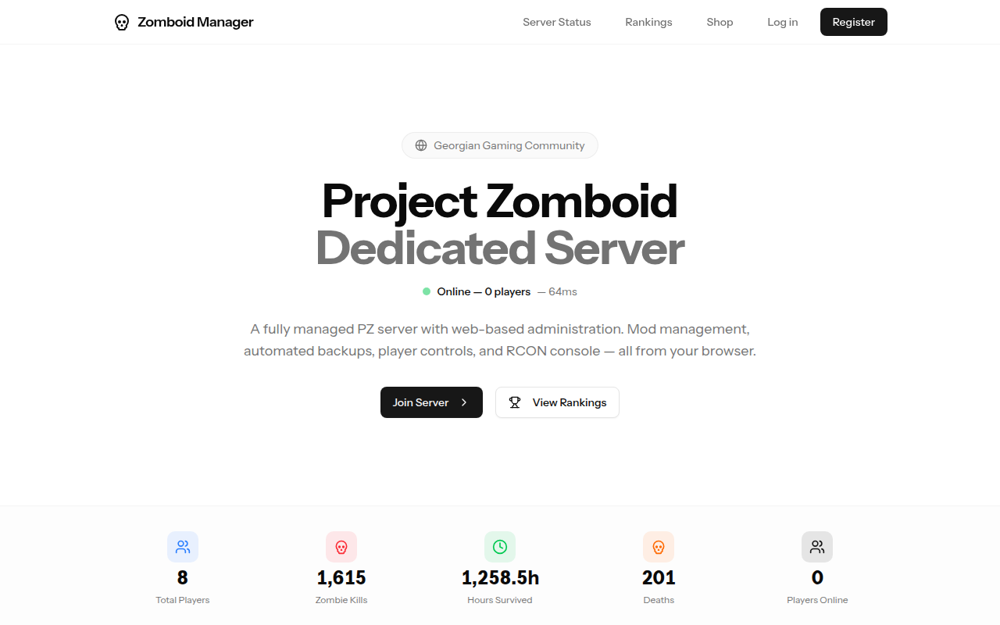
</details>

<details open>
<summary>Dashboard</summary>

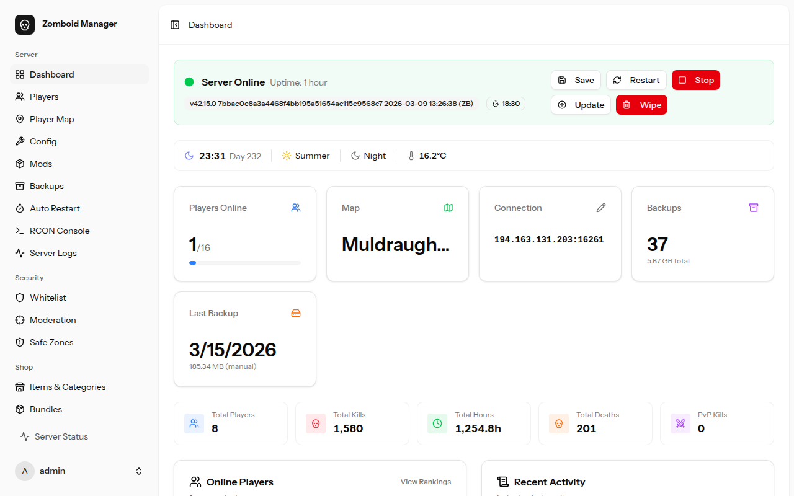
</details>

<details open>
<summary>Players</summary>

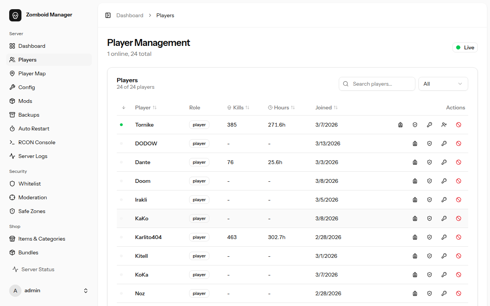
</details>

<details open>
<summary>Player Map</summary>

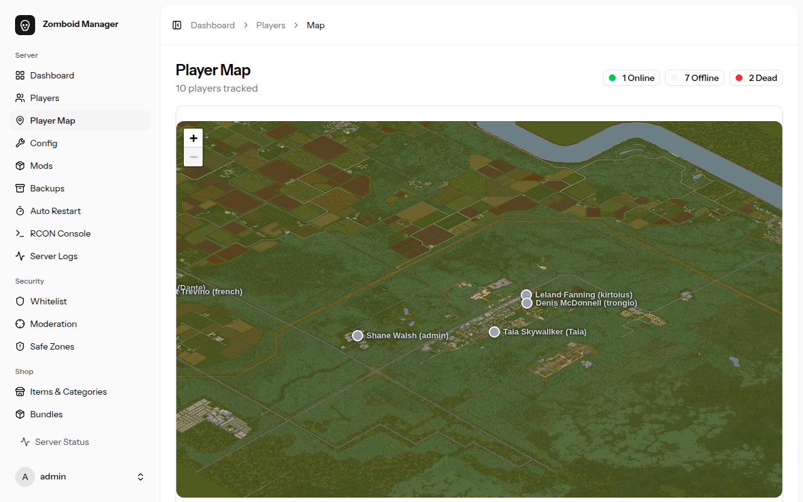
</details>

<details open>
<summary>Inventory</summary>

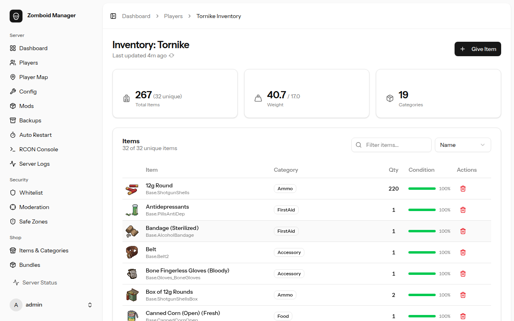
</details>

<details open>
<summary>Configuration</summary>

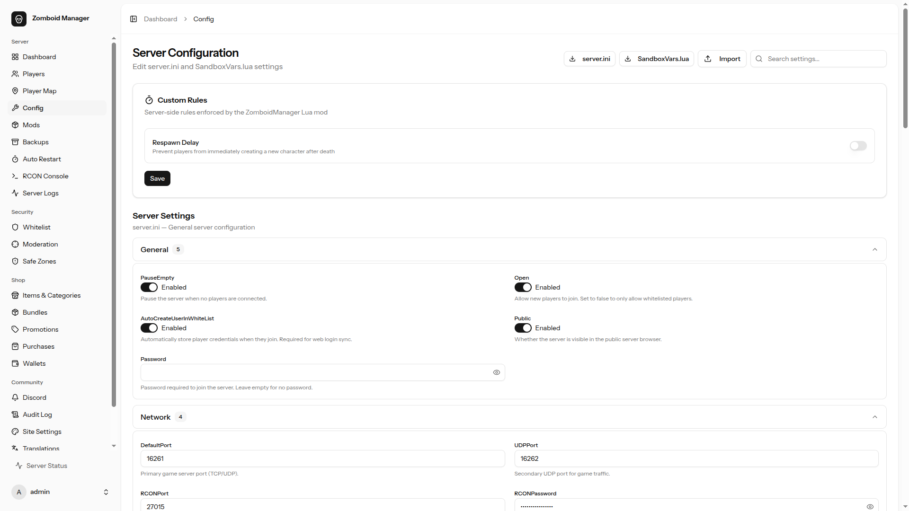
</details>

<details open>
<summary>Mods</summary>

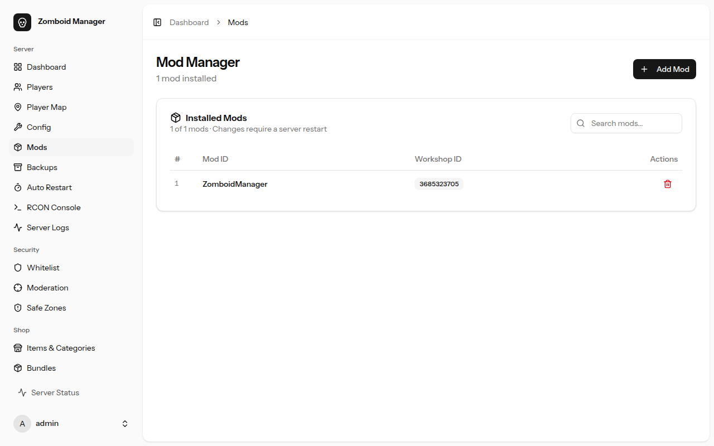
</details>

<details open>
<summary>Backups</summary>

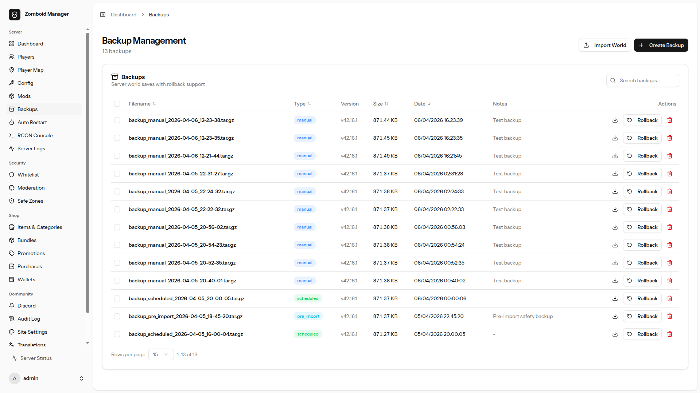
</details>

<details open>
<summary>Auto Restart</summary>


</details>

<details open>
<summary>Whitelist</summary>


</details>

<details open>
<summary>Safe Zones</summary>


</details>

<details open>
<summary>Moderation</summary>


</details>

<details open>
<summary>Discord Webhooks</summary>


</details>

<details open>
<summary>RCON Console</summary>


</details>

<details open>
<summary>Audit Log</summary>


</details>

<details open>
<summary>Server Logs</summary>


</details>

<details open>
<summary>Item Shop</summary>


</details>

<details open>
<summary>Shop Admin</summary>

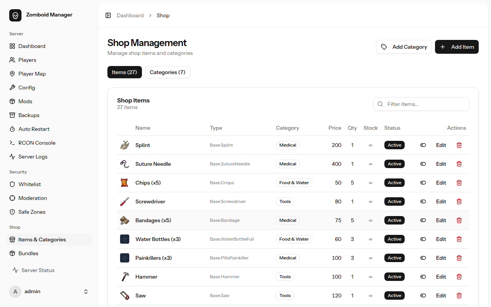
</details>

<details open>
<summary>Shop Bundles</summary>

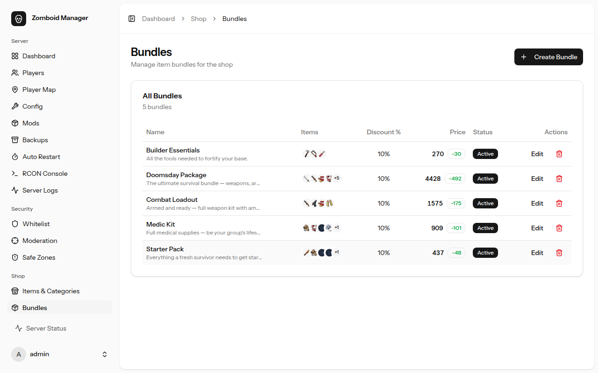
</details>

<details open>
<summary>Shop Promotions</summary>

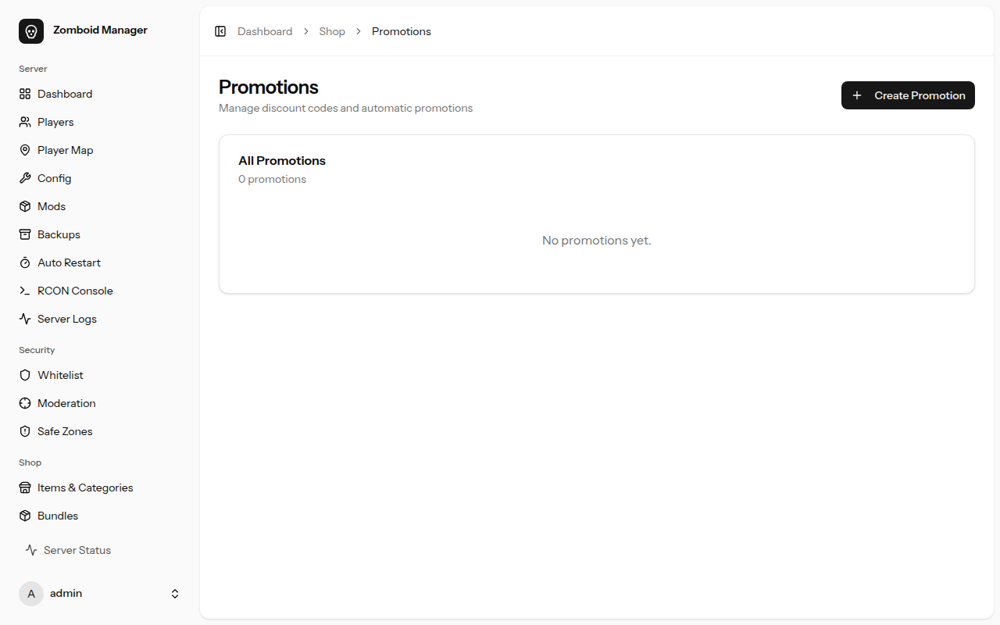
</details>

<details open>
<summary>Shop Purchases</summary>

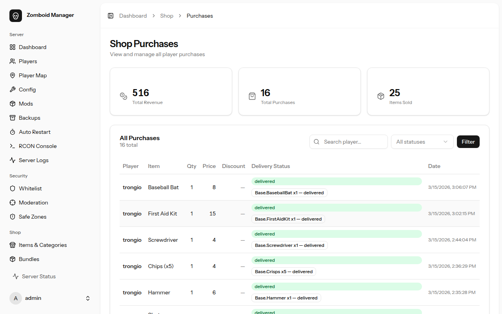
</details>

<details open>
<summary>Wallet Management</summary>

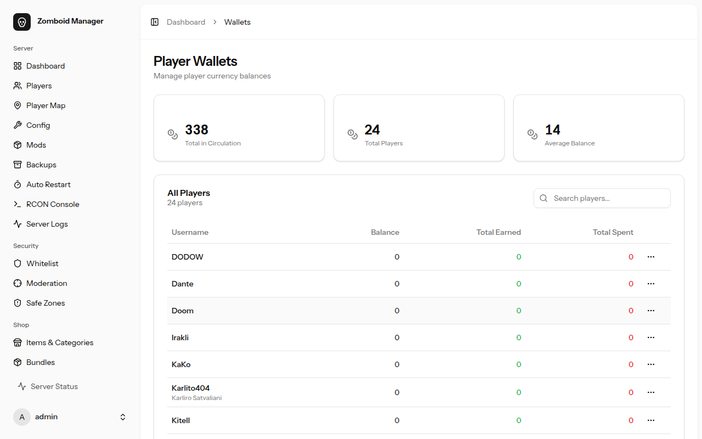
</details>

<details open>
<summary>In-Game Money Deposit</summary>


</details>

<details open>
<summary>Public Status Page</summary>


</details>

<details open>
<summary>Rankings</summary>


</details>

<details open>
<summary>Player Portal</summary>


</details>

## REST API Reference

Authenticated via `X-API-Key` header. The key is auto-generated in `.env` during first run.

### Server

| Method | Endpoint | Auth | Description |
|---|---|---|---|
| `GET` | `/api/server/status` | No | Server status and player count |
| `GET` | `/api/server/version` | Yes | Game version info |
| `GET` | `/api/server/logs` | Yes | Server log output |
| `POST` | `/api/server/start` | Yes | Start the game server |
| `POST` | `/api/server/stop` | Yes | Stop the game server |
| `POST` | `/api/server/restart` | Yes | Restart the game server |
| `POST` | `/api/server/save` | Yes | Force a world save |
| `POST` | `/api/server/broadcast` | Yes | Broadcast message to all players |
| `POST` | `/api/server/update` | Yes | Update game server via SteamCMD |

### Players

| Method | Endpoint | Auth | Description |
|---|---|---|---|
| `GET` | `/api/players` | Yes | List all players |
| `GET` | `/api/players/{name}` | Yes | Player details |
| `POST` | `/api/players/{name}/kick` | Yes | Kick player |
| `POST` | `/api/players/{name}/ban` | Yes | Ban player |
| `DELETE` | `/api/players/{name}/ban` | Yes | Unban player |
| `POST` | `/api/players/{name}/setaccess` | Yes | Set access level |
| `POST` | `/api/players/{name}/teleport` | Yes | Teleport player |
| `POST` | `/api/players/{name}/additem` | Yes | Give item to player |
| `POST` | `/api/players/{name}/addxp` | Yes | Add XP to player |
| `POST` | `/api/players/{name}/godmode` | Yes | Toggle god mode |

### Configuration

| Method | Endpoint | Auth | Description |
|---|---|---|---|
| `GET` | `/api/config/server` | Yes | Read server.ini settings |
| `PATCH` | `/api/config/server` | Yes | Update server.ini settings |
| `GET` | `/api/config/sandbox` | Yes | Read sandbox settings |
| `PATCH` | `/api/config/sandbox` | Yes | Update sandbox settings |

### Mods

| Method | Endpoint | Auth | Description |
|---|---|---|---|
| `GET` | `/api/config/mods` | Yes | List installed mods |
| `POST` | `/api/config/mods` | Yes | Add a mod |
| `DELETE` | `/api/config/mods/{workshopId}` | Yes | Remove a mod |
| `PUT` | `/api/config/mods/order` | Yes | Reorder mod load order |

### Backups

| Method | Endpoint | Auth | Description |
|---|---|---|---|
| `GET` | `/api/backups` | Yes | List backups |
| `POST` | `/api/backups` | Yes | Create a backup |
| `DELETE` | `/api/backups/{backup}` | Yes | Delete a backup |
| `POST` | `/api/backups/{backup}/rollback` | Yes | Rollback to a backup |
| `GET` | `/api/backups/schedule` | Yes | Get backup schedule |
| `PUT` | `/api/backups/schedule` | Yes | Update backup schedule |

### Whitelist

| Method | Endpoint | Auth | Description |
|---|---|---|---|
| `GET` | `/api/whitelist` | Yes | List whitelist entries |
| `POST` | `/api/whitelist` | Yes | Add player to whitelist |
| `DELETE` | `/api/whitelist/{username}` | Yes | Remove from whitelist |
| `GET` | `/api/whitelist/{username}/status` | Yes | Check whitelist status |
| `POST` | `/api/whitelist/sync` | Yes | Sync with game server |

### Other

| Method | Endpoint | Auth | Description |
|---|---|---|---|
| `GET` | `/api/audit` | Yes | Audit log entries |
| `GET` | `/api/health` | No | App health check (status only) |
| `GET` | `/api/health/detailed` | Yes | Detailed health check (RCON, DB, Redis status) |

> **Note:** Features added in Stages 4–6 (item shop, wallets, safe zones, Discord webhooks, auto restart, rankings, respawn delay, moderation) are managed through the web dashboard only and do not have REST API equivalents.

## Commands

### Core

| Command | Description |
|---|---|
| `make init` | Interactive first-run setup wizard (env, admin, start services) |
| `make up` | Start everything (builds + runs) |
| `make down` | Stop and remove all containers |
| `make restart` | Restart all containers |
| `make stop` | Stop containers without removing them |
| `make logs` | Follow logs from all containers |
| `make ps` | Show running containers |
| `make build` | Rebuild Docker images without starting |
| `make arch` | Show detected CPU architecture |

### Database

| Command | Description |
|---|---|
| `make migrate` | Run database migrations (auto-backs up first) |
| `make db-init` | Create the Postgres volume (first run only) |
| `make db-backup` | Dump Postgres to `db-backups/` |
| `make db-restore` | Restore from the latest dump in `db-backups/` |

### Development

| Command | Description |
|---|---|
| `make test` | Run the test suite (isolated SQLite, safe for production) |
| `make exec CMD="..."` | Run a command inside the app container |
| `make update-version` | Update `game-version.conf` with the current PZ build version |

### Danger Zone

| Command | Description |
|---|---|
| `make db-reset` | Delete and recreate the Postgres volume (requires `RESET_DB` confirmation) |
| `make nuke` | Destroy ALL data — database, game saves, backups (requires `NUKE_ALL` confirmation) |

`make test` forces `APP_ENV=testing` with an in-memory SQLite database, so tests never touch production data.

## Project Structure

```
Zomboid_Server/
├── app/                          # Laravel application
│   ├── app/
│   │   ├── Console/Commands/     # 12 Artisan commands (stats sync, deliveries, PvP import, etc.)
│   │   ├── Http/Controllers/
│   │   │   ├── Admin/            # Web dashboard controllers (22 controllers)
│   │   │   ├── Api/              # REST API controllers
│   │   │   └── Settings/         # User settings controllers
│   │   ├── Jobs/                 # 9 queue jobs (backups, restarts, updates, Discord, etc.)
│   │   ├── Models/               # Eloquent models
│   │   └── Services/             # 33 core services
│   │       ├── RconClient.php        # Source RCON TCP client
│   │       ├── DockerManager.php     # Docker Engine API client
│   │       ├── ServerIniParser.php   # server.ini read/write
│   │       ├── SandboxLuaParser.php  # Sandbox Lua read/write
│   │       ├── BackupManager.php     # Backup creation + retention
│   │       ├── WalletService.php     # Player wallet + transactions
│   │       ├── ShopDeliveryService.php  # Item delivery via RCON/Lua
│   │       ├── SafeZoneManager.php   # Safe zone CRUD + violations
│   │       ├── DiscordWebhookService.php
│   │       └── AuditLogger.php       # + 23 more
│   ├── resources/js/
│   │   ├── pages/                # React + Inertia pages (40 total)
│   │   │   ├── admin/            # 19 admin pages
│   │   │   ├── auth/             # 6 auth pages
│   │   │   ├── settings/         # 4 settings pages
│   │   │   ├── shop/             # 4 shop pages (browse, item, wallet, purchases)
│   │   │   ├── welcome.tsx
│   │   │   ├── dashboard.tsx
│   │   │   ├── status.tsx
│   │   │   ├── rankings.tsx
│   │   │   ├── portal.tsx
│   │   │   ├── player-profile.tsx
│   │   │   └── error.tsx
│   │   ├── components/           # Reusable UI components (shadcn/ui)
│   │   └── lib/                  # Utilities (fetchAction, etc.)
│   ├── routes/
│   │   ├── api.php               # REST API routes
│   │   ├── web.php               # Web routes
│   │   └── settings.php          # Settings routes
│   └── tests/                    # Pest PHP tests
├── game-server/
│   └── mods/ZomboidManager/      # Lua bridge mod (14 modules: inventory export,
│                                 #   item delivery, money deposit, player tracking,
│                                 #   PvP tracking, safe zones, respawn delay, etc.)
├── caddy/
│   └── Caddyfile                 # Reverse proxy config (auto-TLS)
├── docker-compose.yml            # Base Docker config
├── docker-compose.arm64.yml      # ARM64 game server override
├── docker-compose.amd64.yml      # AMD64 game server override
├── Makefile                      # All CLI commands
├── .env.example                  # Configuration template
└── docs/screenshots/             # Screenshot assets
```

## Ports

| Port | Protocol | Service | Exposure |
|---|---|---|---|
| `80` | TCP | Caddy (HTTP) | Host — redirects to HTTPS |
| `443` | TCP | Caddy (HTTPS) | Host — auto-TLS via Let's Encrypt |
| `8000` | TCP | Web panel (Nginx) | localhost only — use Caddy for public access |
| `16261` | UDP | Game server | Host — Steam game traffic |
| `16262` | UDP | Game server (direct connect) | Host — Steam direct connect |
| `27015` | TCP | RCON | Internal only — never exposed |
| `5432` | TCP | PostgreSQL | Internal only |
| `6379` | TCP | Redis | Internal only |

## Tech Stack

| Layer | Technology |
|---|---|
| Framework | Laravel 12 (PHP 8.3) |
| Frontend | React 19, Inertia.js v2, TypeScript |
| Styling | Tailwind CSS v4, shadcn/ui |
| Database | PostgreSQL 16, Eloquent ORM |
| Queue / Cache | Redis 7, Laravel Queue |
| Game Server | SteamCMD, Project Zomboid Dedicated Server |
| RCON | Custom PHP Source RCON client (`ext-sockets`) |
| Container Orchestration | Docker Compose v2 (multi-arch) |
| Auth | Laravel Fortify, Sanctum, TOTP 2FA |
| Testing | Pest PHP 3 |
| Routing | Laravel Wayfinder (TypeScript route generation) |

## Resetting

**Regenerate secrets:**

```bash
make down
rm .env
make up
```

**Reset the database:**

```bash
make db-reset    # Requires typing RESET_DB
make up
```

**Nuke everything** (database, game saves, backups):

```bash
make nuke        # Requires typing NUKE_ALL
```

## Security

### Network Isolation

- **RCON port** (27015/tcp) is never exposed to the host — only accessible on the internal Docker network between containers
- **`backend-net`** is marked `internal: true` — PostgreSQL and Redis are unreachable from outside Docker
- **Docker socket proxy** restricts Docker API access to containers, logs, and start/stop only — blocks all other endpoints (image pull, exec, volume mount, etc.)
- **Caddy reverse proxy** available for auto-TLS termination with HTTP→HTTPS redirect
- **Trusted proxies** restricted to RFC 1918 private ranges (`127.0.0.1`, `10.0.0.0/8`, `172.16.0.0/12`, `192.168.0.0/16`) to prevent header spoofing

### Authentication & Access Control

- **Web auth** — Laravel Fortify with session-based login
- **Two-factor authentication** — TOTP with QR code setup, manual key entry, and recovery codes
- **API auth** — `X-API-Key` header with 48 characters of entropy (auto-generated)
- **Token auth** — Laravel Sanctum for token-based API access
- **Role-based access** — Admin middleware protects all management routes
- **PZ passwords** — Hashed as `bcrypt(md5(password))` with a fixed salt, handled separately from Laravel's auth system

### HTTP Security Headers

- **Content Security Policy** — Nonce-based `script-src` generated per request via Vite; restricts `object-src`, `frame-ancestors`, `form-action`, and `base-uri` to `'self'`
- **X-Frame-Options:** `DENY` (clickjacking protection)
- **X-Content-Type-Options:** `nosniff` (MIME sniffing prevention)
- **Referrer-Policy:** `strict-origin-when-cross-origin`
- **Permissions-Policy:** Disables camera, microphone, and geolocation
- **HSTS:** `max-age=31536000; includeSubDomains` at the Nginx layer

### Input Validation & Injection Prevention

- **RCON injection prevention** — All RCON arguments are sanitized through `RconSanitizer` with per-type validation: player names (`[a-zA-Z0-9_]{1,50}`), item IDs (`[a-zA-Z0-9_.]{1,100}`), skills (alphanumeric), access levels (whitelist of 6 values), and messages (no `"`, `\n`, `\r` to prevent command boundary breakage)
- **Config injection prevention** — `SafeConfigValue` rule uses an allowlist-based pattern, rejects Lua concatenation operators (`..`), and blocks newline injection in INI files
- **Form Request validation** — All admin controller methods use dedicated Form Request classes with `RconSafeIdentifier` and `RconSafeMessage` rules; no inline `$request->validate()`
- **Route parameter patterns** — `name` and `username` parameters enforce `[a-zA-Z0-9_]{1,50}` at the routing layer via `AppServiceProvider`

### Rate Limiting

Three tiers of rate limiting protect against abuse:

| Tier | Limit | Applies To |
|---|---|---|
| `admin` | 60/min | General admin actions |
| `admin-sensitive` | 10/min | Kick, ban, RCON, server control, password changes |
| `admin-destructive` | 2/min | Server wipe |
| `api` (authenticated) | 60/min | API key requests |
| `api` (anonymous) | 15/min | Unauthenticated API requests |

Sensitive operations stack both `admin` and `admin-sensitive` limiters for an effective 10/min cap.

### Audit & Compliance

- Every admin action is recorded with timestamp, user, action type, IP address, and full request payload
- **Immutable audit trail** — Audit log deletion is blocked at the model layer (`AuditLogObserver` throws `RuntimeException`)
- **Sensitive field filtering** — Passwords, API keys, tokens, secrets, and 2FA codes are stripped from audit log payloads automatically
- Discord webhook notifications on audit log creation (optional)

### Backup Security

- **Tar slip protection** — Archive contents are validated before extraction; rejects entries with `..` path traversal or absolute paths
- **`--no-absolute-names`** flag as a secondary safeguard during tar extraction

### Infrastructure

- **Entrypoint validation** — Container startup fails fast if `DB_PASSWORD`, `PZ_RCON_PASSWORD`, `ADMIN_PASSWORD`, or `PZ_ADMIN_PASSWORD` are empty
- **Destructive operations** (wipe, nuke, db-reset) require explicit confirmation strings
- **Health endpoint split** — `/api/health` is public (status only), `/api/health/detailed` requires API key (returns internal service details)
- **No `.env` comments** — Environment files omit inline comments to prevent PZ server parsing issues

---

## Disclaimer

This software is provided "as is", without warranty of any kind, express or implied. Use it entirely at your own risk.

- The authors are **not responsible** for any data loss, server corruption, downtime, or other damages resulting from the use of this software.
- This project is **not affiliated with or endorsed by** The Indie Stone, Valve, or Steam.
- You are solely responsible for ensuring your server complies with the [Project Zomboid Dedicated Server EULA](https://projectzomboid.com) and Steam's Terms of Service.
- Running game servers, Docker containers, and RCON commands carries inherent risks — always maintain your own backups.

By using this software, you acknowledge and accept these terms. See the [LICENSE](LICENSE) file for full legal details.

---

<div align="center">

Created with ❤️ by [nmhung1993](https://github.com/nmhung1993)

</div>
